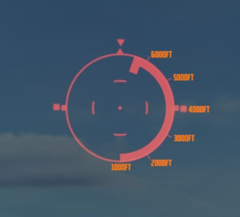
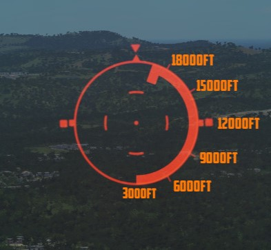

# 计算提前角的光学瞄准系统（LCOSS）

计算提前角的光学瞄准系统，简称 LCOSS，用于为空对空或空对地武器投放建立视觉瞄准参考。在 LCOSS 中，系
统将在半反射玻璃上投射一个红色准星。LCOSS 具有七种不同的模式，可通过瞄准具模式旋钮进行选择。

## LCOSS 控制开关/按钮

### 瞄准具模式旋钮

瞄准具模式旋钮可选择以下工作模式：

| 瞄准具模式旋钮     | 功能                                                                                                  |
| ------------------ | ----------------------------------------------------------------------------------------------------- |
| **OFF**            | 瞄准具系统断电。                                                                                      |
| **STBY**           | 瞄准具系统通电但不显示任何准星。                                                                      |
| **CAGE**           | 显示准星并锁定在雷达瞄准轴线（RBL）上。                                                               |
| **A/G**            | 选择空对地模式。准星可从零度密位下压至机身基准线（FRL）下方 245 密位。                                |
| **A/A**            | 选择空对空提计算提前角模式。准星位置由，瞄准具陀螺、雷达距离、CADC 传感器和油门握把上的锁定按钮控制。 |
| **BIT 1 和 BIT 2** | 计算提前角放大器继电器通电，向瞄准具系统施加固定电压来进行自检。显示自检图案。                        |

### 准星下压控制

飞行员可通过旋转准星下压旋钮压低准星，直到读数（一密位为增量）显示所需的瞄准具设置。机组无法手动调
整准星的方位指向。

### 准星亮度控制

转动准星亮度控制旋钮来调整准星的亮度。

### 光栅手柄

光栅控制手柄有两个档位，分别为 CL（关闭）和 OPEN（打开）。在 CL 档位，光栅将被置于光学光源和半反射
玻璃之间，从而防止强光对光学器件造成损伤。在 OPEN 档位，光栅被移开，并显示准星。

## 准星图像

投射到半反射玻璃上的准星图像由固定准星、横滚基准标签和距离条组成。固定准星由一个直径 25 密位的分段
圆环，及其中心的直径 2 密位准星和一个直径 50 密位的完整圆组成。

横滚基准标签围绕 50 密位完整圆进行旋转，且有两个不同的功能——在偏置投弹模式和目标搜寻模式下，横滚基
准标签显示 WRCS 提供的转向信息。横滚基准标签将相对固定指针标签旋转来显示地面航迹与向目标飞行的航线
之间的角度差。在其它操作模式下，横滚基准标签显示由 INS 提供的飞机横滚姿态。

| 横滚标签左旋                                                | 横滚标签右旋                                                  |
| ----------------------------------------------------------- | ------------------------------------------------------------- |
|  |  |
| _1 左横滚标签, 2 中间横滚标签, 3 右横滚标签_                | _1 左横滚标签, 2 中间横滚标签, 3 右横滚标签_                  |

测距条呈半圆形显示，只有在雷达锁定目标时才会出现在 50 密位圆环的内侧。测距条的实时长度和长度的变化
速度表示雷达的实际斜距以及飞机与目标之间的距离。距离条的最小长度（和最小距离指示）位于 6 点钟位置。
选择航炮时，距离条缩短至 6 点位置，实际雷达距离为 1000 英尺。在 5 点钟位置，距离条为 2000 英尺，每
个刻度增加 1000 英尺。选择航炮模式时，可显示的最大距离为 6667 英尺。选择航炮以外的其它模式时，距离
条在 6 点位置表示的距离为 3000 英尺，在 5 点为 6000 英尺，每个刻度标线的增量为 3000 英尺。此时最大
可显示距离为 20000 英尺。

| 选择航炮时的距离条                                               | 选择其它模式时的距离条                                          |
| ---------------------------------------------------------------- | --------------------------------------------------------------- |
|  |  |

## 准星锁定功能

飞行员可通过油门握把上的 CAGE 按钮来使用准星锁定功能。当瞄准具在 (航炮) A/A 工作模式下并按下 CAGE（
无雷达锁定）后，准星将锁定在雷达瞄准轴线（RBL）上。松开 CAGE 按钮后，系统将发送一个 1000 英尺模拟距
离到计算机，但距离条不会显示出来。存在雷达锁定时按下 CAGE 按钮将使用固定功能（注：1000 英尺提前量计
算）。距离条将继续指示实际雷达距离或最大可显示距离。松开 CAGE 按钮后准星将在方位和仰角方向上移动来
显示最远 4000 英尺提前角需求。仅在选择了航炮时发生。
