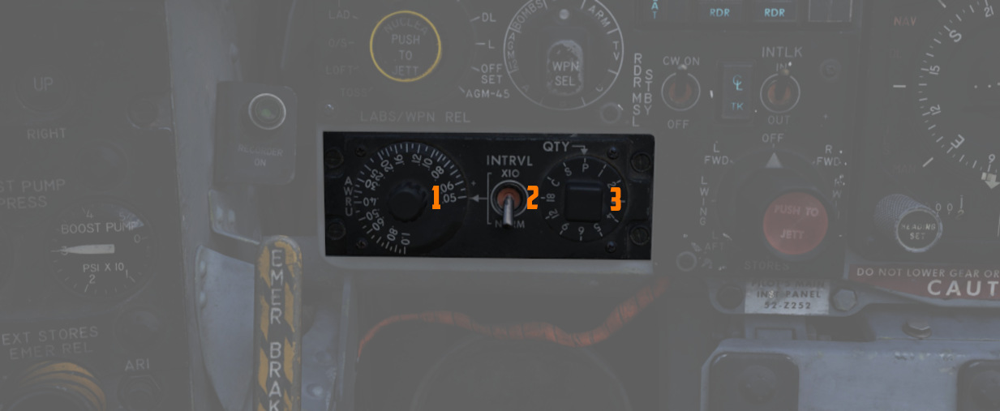

# Lead computing optical sight system (LCOSS)

 TODO change

The lead computing optical sight system or short LCOSS, is used to establish a visual sight
reference to either air-to-air or air-to-ground weapons delivery. A red reticle is projected on a
combining glass. The LCOSS features seven different modes that can be selected via the Sight Mode
Knob.

## LCOSS Controls

### Sight mode knob

The sight mode knob selects the mode of operations which are the following:

| Sight mode knob     | Function                                                                                                                                                        |
|---------------------|-----------------------------------------------------------------------------------------------------------------------------------------------------------------|
| **OFF**             | De-energizes the sight system.                                                                                                                                  |
| **STBY**            | Energizes the sight system for warmup but does not display any reticle.                                                                                         |
| **CAGE**            | Reticle is displayed and caged at the radar boresight line (RBL).                                                                                               |
| **A/G**             | Selects the air-to-ground mode. The reticle is depressable from zero mils to 245 mils below the fuselage reference line (FRL).                                  |
| **A/A**             | Selects the air-to-air lead compute mode. The reticle position is governed by the sight gyro, radar range, the CADC Sensor and the cage button on the throttle. |
| **BIT 1 and BIT 2** | Energizes the lead computing amplifier relays so that fixed voltages are applied to the sight system for a self test. Displays self test pictures.              |

### Reticle depression control

The reticle can be depressed by rotating the reticle depression knob until the readout (in one-mil
increments) shows the desired sight setting. The Reticle cannot be positioned manually in azimuth.

### Reticle intensity control

Rotating the reticle intensity control knob changes the brightness of the reticle.

### Shutter lever control

The shutter control lever is a two position lever with positions of CL (closed) and OPEN. In the CL
position a shutter is placed between the optical light source and the combining glass thus
preventing damage to the optics from bright sunlight. In the OPEN position the shutter is removed
and the reticle will be displayed.

## Reticle Image

The reticle image that is projected onto the combining glass is composed of a fixed reticle, roll
reference tabs, and a range bar. The fixed reticle consists of 2-mil diameter pipper located in the
center of a 25-mil diameter segmented circle, and a 50-mil diameter completed circle.