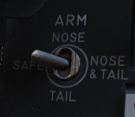

# Multiple Weapons System

The Multiple Weapons System is designed to provide a single point of management
for all stores deliverable by the F-4 with regards to arming, pylon activation,
delivery mode, and selective jettison. While specific weapons may have
additional controls elsewhere in the cockpit on a case by case basis, all of the
noted functions are driven by this panel on the left forward console in the
front cockpit.

## Nose/Tail ARM Switch

Beginning from the top of the panel, the four way Nose/Tail ARM switch selects
the solenoids for arming wire capture on MERs and TERs, which then arm the fuzes
at the point of release. Additionally, the switch position can also dictate
in-flight high/low drag release mode for retarded bombs such as the [Mk 82
Snakeye](../../stores/air_to_ground/bombs/conventional_bombs.md).

| Name      | Description                                                                       |
|-----------|-----------------------------------------------------------------------------------|
| SAFE      | No arming solenoids activate; bombs release without fuzing enabled.               |
| NOSE      | Forward and center position solenoids activate to hold arming lanyards.           |
| TAIL      | Aft position solenoids activate to hold arming lanyards.                          |
| NOSE/TAIL | Forward, center, and aft position solenoids all activate to hold arming lanyards. |

MER-10 and TER-9 racks include an automatic stepper mode function to
automatically bypass stations that have already released munitions. To set this
function, when the BOMBS mode of the Weapon Select Knob is chosen, the Nose/Tail
switch must be in the NOSE or the NOSE & TAIL position for release signals to be
delivered through installed MERs and TERs and bypass empty positions; if the
system is set in TAIL, an additional release pulse(s) must be applied using the
bomb switch to cycle through the empty stations. Usage of the MER-10A and TER-9A
circumvent this requirement.

RKTS and DISP bypass empty stations automatically.

## Station Select Buttons

## Mode Selection - Delivery Mode Knob

Release mode is set using the Delivery Mode Knob. Values to the left of OFF
employ the AN/AJB-7 Attitude Reference and Combing Computer
Set ([ARBCS](https://heatblur-simulations.github.io/f-4e-manual/systems/weapon_systems/arbcs.html)),
whereas
values to the right of DIRECT employ the Weapon Release Computer
Set ([WRCS](https://heatblur-simulations.github.io/f-4e-manual/systems/weapon_systems/arbcs.html)).
DIRECT is the manual release mode. TGT FIND functions as a navigational mode,
and cannot provide a weapon release signal to the fire control, thus can be
considered in practice a "safe" position.

The values, clockwise from the left, are as follows:

| Name     | Description                            | System                                                                                        |
|----------|----------------------------------------|-----------------------------------------------------------------------------------------------|
| INST O/S | Instantaneous Over the Shoulder        | [ARBCS](https://heatblur-simulations.github.io/f-4e-manual/systems/weapon_systems/arbcs.html) |
| LOFT     | Loft                                   | [ARBCS](https://heatblur-simulations.github.io/f-4e-manual/systems/weapon_systems/arbcs.html) |
| O/S      | (Timed) Over the Shoulder              | [ARBCS](https://heatblur-simulations.github.io/f-4e-manual/systems/weapon_systems/arbcs.html) |
| T LAD    | Timed LADD (Low Angle Drogue Delivery) | [ARBCS](https://heatblur-simulations.github.io/f-4e-manual/systems/weapon_systems/arbcs.html) |
| TL       | Timed Level                            | [ARBCS](https://heatblur-simulations.github.io/f-4e-manual/systems/weapon_systems/arbcs.html) |
| OFF      | Off                                    |                                                                                               |
| DIRECT   | Manual                                 |                                                                                               |
| TGT FIND | Target Find (Navigation only)          | [WRCS](https://heatblur-simulations.github.io/f-4e-manual/systems/weapon_systems/wrcs.html)   |
| DT       | Dive Toss                              | [WRCS](https://heatblur-simulations.github.io/f-4e-manual/systems/weapon_systems/wrcs.html)   |
| DL       | Dive Laydown                           | [WRCS](https://heatblur-simulations.github.io/f-4e-manual/systems/weapon_systems/wrcs.html)   |
| L        | Laydown                                | [WRCS](https://heatblur-simulations.github.io/f-4e-manual/systems/weapon_systems/wrcs.html)   |
| OFFSET   | Offset Bomb                            | [WRCS](https://heatblur-simulations.github.io/f-4e-manual/systems/weapon_systems/wrcs.html)   |
| AGM-45   | AGM-45 Delivery                        | [WRCS](https://heatblur-simulations.github.io/f-4e-manual/systems/weapon_systems/wrcs.html)   |

## Weapon Selector Knob

The Weapon Selector Knob is used to designate the type of weapon to be used

| Name        | Description                                                                                                                                    |
|-------------|------------------------------------------------------------------------------------------------------------------------------------------------|
| RKTS & DISP | [Rockets](https://heatblur-simulations.github.io/f-4e-manual/stores/air_to_ground/rockets.html) and dispensers. Arms AWRU release circuitry.   |
| ARM         | [AGM-45 Shrike](https://heatblur-simulations.github.io/f-4e-manual/stores/air_to_ground/missiles/shrike.html)                                  |
| TV          | [AGM-65 Maverick](https://heatblur-simulations.github.io/f-4e-manual/stores/air_to_ground/missiles/maverick.html) and other EO guided weapons. |
| C           | Open/unused. May be utilized as an OFF selection.                                                                                              |
| B           | Same function as AIR-TO-AIR button in rear cockpit.                                                                                            |
| A           | Munitions with internally-set intervalometers (CBUs or spray containers).                                                                      |
| AGM 12      | AGM-12 Bullpup.                                                                                                                                |
| BOMBS       | [Bombs](https://heatblur-simulations.github.io/f-4e-manual/stores/air_to_ground/bombs/conventional_bombs.html). Arms AWRU release circuitry.   |

## Centerline Tank Aboard Light

The [forward AIM-7 missiles](https://heatblur-simulations.github.io/f-4e-manual/stores/air_to_air/aim_7.html)
can be
inhibited from launch under certain centerline
conditions due to possible separation issues or chance of igniting the contents
of the centerline position. The CL tank light will illuminate if such a possible
condition exists. The conditions that can cause this are as follows:

1. Fuel Tank or MER; the forward Sparrows cannot be launched. The CL tank light
   will shut off if the tank or MER is jettisoned, allowing launch or jettison.

2. BRU-5/A with single bomb; the CL tank light will illuminate. Forward position
   Sparrows can be launched or jettisoned, however, attention should be paid to
   eliminate lateral roll movements until the launched weapon is clear.

3. Aero-27/A with Centerline Arming Unit. The CL tank light will illuminate,
   however the forward position AIM-7s cannot be jettisoned or released until
   this is removed post-flight.

## Interlock Switch

The fire control system provides an inhibitor option for AIM-7 launches to
confirm valid parameters are met, and is accessed with the INTLK switch. With IN
selected, the missile will not release upon trigger down should any of the
following not be the case:

1. The IN RANGE lamp illuminated
2. The target aim dot within the ASE (Allowable Steering Error) circle
3. The radar knob is not in VI mode

With the INTLK switch in OUT, the AIM-7 can be launched at any time, no matter
the condition of the current parameters against the target.

The INTLK switch provides no function for AIM-9 launch.
