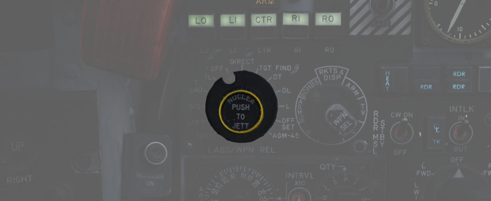

# 多武器系统

多武器系统旨在将 F-4 所有可投放的挂载进行集中管理，包括引信、挂架激活、投放模式，以及选择性抛弃。虽
然有些武器将视情况可能在驾驶舱其它面板中有额外的控制开关/按钮，不过上述所有功能都在位于前座左侧子面
板上的武器管理面板进行控制。

## 头部/尾部解除保险开关

从面板顶部开始，一个头部/尾部解除保险开关用于控制 MER 和 TER 的解除保险电磁开关——开关将在投放弹药时
让引信进入待爆状态。此外，开关的档位还可决定例如
[Mk 82 蛇眼](../../stores/air_to_ground/bombs/conventional_bombs.md) 等高阻炸弹的高/低阻投放模式。

| 档位      | 描述                                         |
| --------- | -------------------------------------------- |
| SAFE      | 不激活解除保险电磁开关，航弹投出时引信安全。 |
| NOSE      | 前、中部电磁开关激活来拉住解除保险短索。     |
| TAIL      | 后部电磁开关激活来拉住解除保险短索。         |
| NOSE/TAIL | 前、中和后部电磁开关激活来拉住解除保险短索。 |

MER-10 与 TER-9 挂架拥有自动步进模式，可以自动跳过已投放过武器的挂点。飞行员需要将武器选择旋钮选中
BOMBS 档位，头/尾解除保险开关必须在 NOSE 或者 NOSE & TAIL 档位，才能启用这项功能让投放信号传输到安
装的 MER 与 TER 挂架，并跳过空挂点。头/尾解除保险开关在 TAIL 档位时，则需要多按一下投弹按钮（或多次
）来反复跳过空挂点。使用 MER-10A 与 TER-9A 时可无视此要求。

RKTS 与 DISP 将会自动绕过空挂点。

## 挂点选择按钮

使用挂点选择按钮可以在对应挂点上选择不同的武器，但不包括空对空武器。

## 模式选择—投弹模式旋钮

飞行员通过投放模式旋钮设置投放模式。OFF 以左的档位使用 AN/AJB-7 姿态基准与投弹计算机组
([ARBCS](../../systems/weapon_systems/arbcs.md))，而 DIRECT 以右的档位使用武器投放计算机套件
([WRCS](../../systems/weapon_systems/arbcs.md))。DIRECT 为手动投放模式。TGT FIND 作为导航模式使用，
无法向火控提供武器投放信号，因此实际使用中可作为“安全”档位使用。

从左侧开始按顺时针转动旋钮，功能如下：

| 档位     | 描述                                                           | 系统                                           |
| -------- | -------------------------------------------------------------- | ---------------------------------------------- |
| INST O/S | 实时越肩（Instantaneous Over the Shoulder）                    | [ARBCS](../../systems/weapon_systems/arbcs.md) |
| LOFT     | 上仰                                                           | [ARBCS](../../systems/weapon_systems/arbcs.md) |
| O/S      | （计时）越肩 (Timed) Over the Shoulder                         | [ARBCS](../../systems/weapon_systems/arbcs.md) |
| T LAD    | 计时 LADD (低角度伞投)                                         | [ARBCS](../../systems/weapon_systems/arbcs.md) |
| TL       | 计时平投（Timed Level）                                        | [ARBCS](../../systems/weapon_systems/arbcs.md) |
| OFF      | 关闭                                                           |                                                |
| DIRECT   | 手动直接                                                       |                                                |
| TGT FIND | 目标搜寻 (仅限导航模式和[Pave Spike](pave_spike/overview.md)） | [WRCS](../../systems/weapon_systems/wrcs.md)   |
| DT       | 俯冲改出投弹（Dive Toss）                                      | [WRCS](../../systems/weapon_systems/wrcs.md)   |
| DL       | 俯冲铺投（Dive Laydown）                                       | [WRCS](../../systems/weapon_systems/wrcs.md)   |
| L        | 铺投（Laydown）                                                | [WRCS](../../systems/weapon_systems/wrcs.md)   |
| OFFSET   | 偏置投弹                                                       | [WRCS](../../systems/weapon_systems/wrcs.md)   |
| AGM-45   | AGM-45 投放                                                    | [WRCS](../../systems/weapon_systems/wrcs.md)   |

## 武器选择旋钮

武器选择旋钮用于指定使用武器的种类

| 档位        | 描述                                                                                 |
| ----------- | ------------------------------------------------------------------------------------ |
| RKTS & DISP | [航箭](../../stores/air_to_ground/rockets.md) 与布撒器。激活 AWRU 投放电路。         |
| ARM         | [AGM-45"百舌鸟"](../../stores/air_to_ground/missiles/shrike.md)                      |
| TV          | [AGM-65 幼畜](../../stores/air_to_ground/missiles/maverick.md) 与其它光电制导武器。  |
| C           | 开路/不使用。可作为 OFF 档使用。                                                     |
| B           | 与后座 AIR-TO-AIR 按钮的作用相同。                                                   |
| A           | 内置定时控制器的武器（CBU 或布撒器）。                                               |
| AGM 12      | [AGM-12 “小斗犬”](../../stores/air_to_ground/missiles/bullpup.md).                   |
| BOMBS       | [航弹](../../stores/air_to_ground/bombs/conventional_bombs.md)。激活 AWRU 投放电路。 |

## 中线副油箱抛弃灯

由于潜在分离问题或可能点燃中线挂载问题，[前部 AIM-7 导弹](../../stores/air_to_air/aim_7.md) 在特定
中线挂点配置下会被禁止发射。如果满足禁止发射的条件，中线副油箱抛弃灯将亮起，这些条件如下：

1. 油箱或 MER：前部麻雀不能发射。抛离副油箱或 MER 后中线副油箱抛弃灯熄灭，可以发射或抛弃麻雀。
2. 挂载单枚炸弹的 BRU-5/A：中线副油箱抛弃灯亮起。前部麻雀可以发射或被抛弃，不过在武器远离机身前应尽
   量减少横滚动作。
3. 装有中线解除保险装置的 Aero-27/A：中线副油箱抛弃灯亮起，但除非在飞行前拆除它，否则前部 AIM-7 不
   能发射或被抛弃。

## 互锁开关（INTLK）

火控系统在满足有效参数前会禁止 AIM-7 发射，此功能由 INTLK 开关控制。选择 IN 档位时，只有在满足下列
条件时，扣动扳机才会发射导弹：

1. IN RANGE 灯亮起
2. 目标瞄准点在 AES 圆（允许转向误差）内
3. 雷达旋钮不在 VI 模式

INTLK 开关处于 OUT 档位时，可随时发射 中线副油箱抛弃灯，无需考虑当前目标是否满足发射参数。

INTLK 开关不影响 AIM-9 发射。
