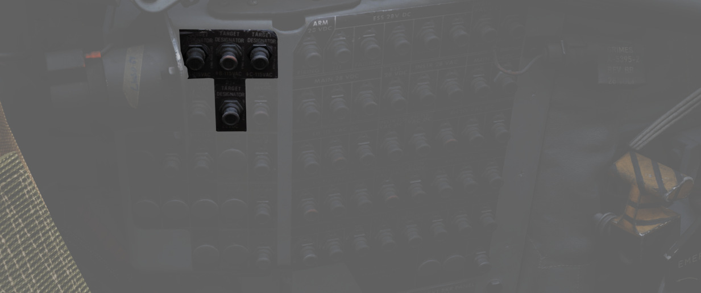

# 电气系统

Pave Spike 通过 [4 号断路器面板](../../../systems/electrics.md#cb-panel-4)（WSO，左侧墙板）上的 4
个断路器供电。左侧主 AC 总线和主 DC 总线的电流将流经断路器。

系统的所有面板都直接通过吊舱供电，因此，如果没有挂载 Pave Spike 瞄准吊舱，系统的所有面板都将断电。

💡 无需打开吊舱本身来使电力通过吊舱输送到面板。
