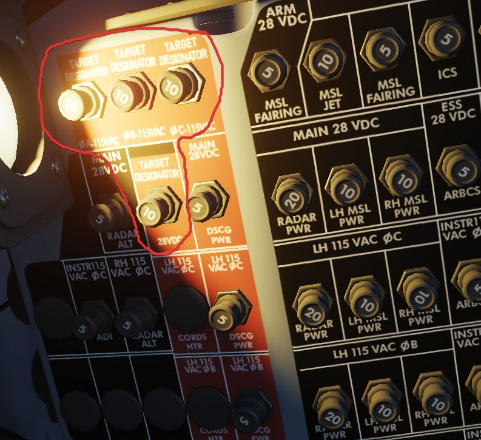

# Electrics

The Pave Spike draws its power through 4 circuit breakers on the
[No. 4 CB Panel](../../../systems/electrics.md#cb-panel-4)
(WSO, left wall). They forward current from the left main AC bus and the main DC
bus.

All panels of the system are powered directly through the pod, and hence will be
turned off if the Pave Spike targeting pod is not equipped.

> 💡 It is not required to turn on the pod itself in order for power to be routed
> through the pod to the panels.
