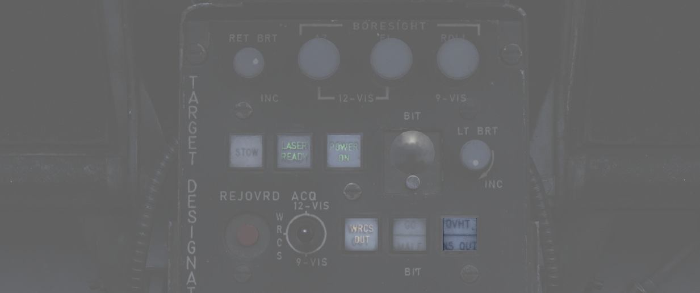

# 一体化

## INS 一体化

正常工作时，吊舱与 INS 相连。WSO 可按下 INS OUT 按钮来手动禁用一体化。

禁用 INS 后，以下功能 **不可用** ：

- 跟踪模式下的自动目标稳定
- 12-VIS 捕获模式下的横滚稳定
- 斜距计算- WRCS 一体化

## WRCS 一体化

正常工作时，吊舱与 WRCS 相连。WSO 可按下 WRCS OUT 按钮来手动禁用一体化。

此外，在没有 INS 一体化或者当前不在 DIRECT 或 TGT FIND 武器模式下，WRCS 会被自动禁用。

当 WRCS 不可用，以下功能 **不可用** ：

- WRCS 捕获模式
- 记忆模式
- WRCS 自动武器投放

并且一些功能将降级，但 **仍然可用** ：

- 斜距计算
- 跟踪模式下的自动目标稳定
