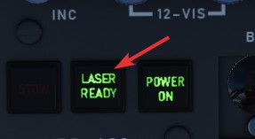
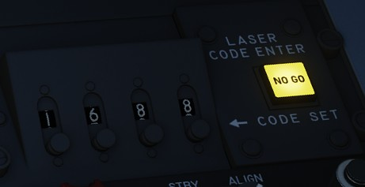
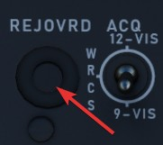

# Laser System

The laser can only be operated in the Track-mode and serves two purposes:

- Guiding laser guided weapons on a target,
- and accurate slant range measurement.

Slant range is, besides weapon impact calculations, used for the automatic
target stabilization in Track-mode. If not measured with the laser, it is
computed based on inaccurate INS and WRCS data, resulting in a degradation of
the system.

The laser can be used when the LASER READY lamp is illuminated.

To setup the laser, a valid code has to first be entered on the Laser Coder
Control panel and transferred to the pod by pressing the Enter-Button. Make sure
that the NO GO light does not remain illuminated.

The LASER READY push button has to be pushed in for the laser to be armed.

Additionally, the laser is guarded by the nose gear position, which has to be
fully retracted to prevent accidental use on the ground.

Once ready, the laser is fired during track mode by pressing full action on the
Antenna Stick. The status of the laser operation is indicated by the cues on the
display being steady or flashing.

| Indication    | T0                                    | TTG                                     |
| ------------- | ------------------------------------- | --------------------------------------- |
| not shown     | not in TRACK mode                     | not in TRACK mode                       |
| steady        | commanded to fire laser (full action) | firing laser, accepted range            |
| flashing fast | not commanded to fire laser           | not firing laser or target too far away |
| flashing slow |                                       | firing laser, but range rejected        |

The T0 cue indicates intention to fire the laser, while the TTG cue represents
the outcome of the laser usage.

The slant range measured by the laser is compared to the slant range computed
based on INS and WRCS data. If it is not within ±20% percent of that value, it
is rejected. This is indicated by TTG flashing slow.

The system can be forced to use the laser range regardless, by pressing the
Reject/Override Button.

In practice, laser measured range is much more accurate than the slant range
computed by the system. Hence, pilots developed a habit of always hitting the
button whenever they fired the laser.

> 💡 This habit can lead to trouble during shallow attacks, such as when flying low altitude,
> where a small input can quickly lead to the slant range measured by the laser being very off.
> And hence cause the stabilization to drift off quickly.
