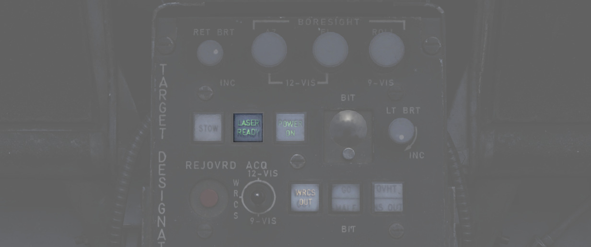
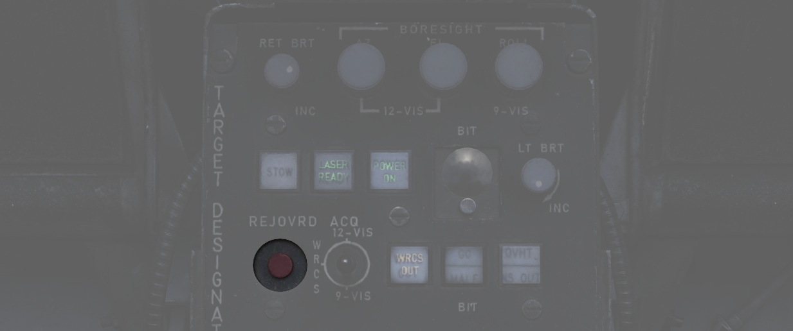

# 激光系统

激光只能在跟踪模式下使用，其有两种用途：

- 为激光制导武器提供制导飞向目标，
- 以及精确测量斜距。

除武器命中计算外，斜距还用于跟踪模式下的自动目标稳定。如果不使用激光测距，则要根据不准确的 INS 和
WRCS 数据进行计算，从而导致系统性能降低。

当 LASER READY 灯亮起时，即可使用激光。

如需设置激光，首先必须在激光编码器控制面板上输入一个有效的编码，然后按输入按钮将编码传输到吊舱中。
确保 NO GO 指示灯不再亮起。

WSO 必须按下激光就绪按钮，才能解除激光保险。

此外，激光还受到前轮位置的保护，前轮必须完全收起才可使用激光，以防止在地面上意外使用。

准备就绪后，在跟踪模式下按下天线杆上的扳机第二段即可发射激光。激光操作的状态由显示屏上的提示符常亮
或闪烁来指示。

| 指示     | T0                     | TTG                  |
| -------- | ---------------------- | -------------------- |
| 不显示   | 未进入跟踪模式         | 未进入跟踪模式       |
| 常亮     | 指令照射激光(二段扳机) | 照射激光，距离有效   |
| 快速闪烁 | 未指令激光照射         | 未照射激光或目标太远 |
| 慢速闪烁 |                        | 照射激光，但距离无效 |

T0 提示表示是否指令发射激光，而 TTG 提示则代表使用激光的结果。

激光测量的斜距将与基于 INS 和 WRCS 数据计算的斜距进行比较。如果不在测得值的 ±20%范围内，则拒绝此数
据。TTG 慢速闪烁表示拒绝使用数据。

WSO 可通过按下断开/超控按钮来使系统强制使用激光测距。

在实际应用中，激光测得的距离要比系统计算的斜距精确得多。因此，飞行员养成了每次照射激光时始终按下按
钮的习惯。

> 💡 这种习惯可以导致在小角度俯冲攻击时出现问题，例如在低空飞行时，一个小的输入会迅速导致激光测量的斜
距失准，从而导致镜头开始漂移。
