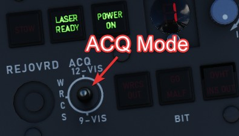
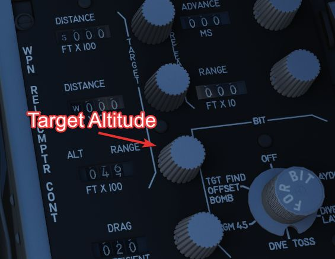
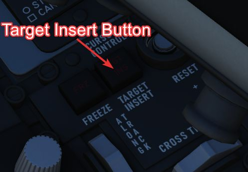

# Modes

Prior to being able to designate a target, one has to visually acquire the
general target area and put the LOS in the vicinity. This is done by using one
of three acquisition modes:

- 12-VIS
- 9-VIS
- WRCS

The modes can be selected by the WSO, using the Acquisition Mode Switch.

## Visual modes

In 12-VIS and 9-VIS, the LOS is set to a fix position.

- 12-VIS: 0 degrees roll, -2 degrees elevation, looking slightly nose down
- 9-VIS: -90 degrees roll (CW), -90 degrees elevation (down), looking left

12-VIS can be a great way to find targets of opportunity, as it allows the pilot
to put a target directly on the nose. The position also corresponds to the caged
HUD reticle. Additionally, if the INS is integrated with the pod, 12-VIS is
roll-stabilized.

The use of 9-VIS is very limited. It is intended to aid in acquiring a target
while observing an area in a turn. The target has to be put on the extension of
the left wing. However, in practice it is very difficult to maintain a turn in
such an attitude.

## WRCS mode

The main mode to acquire targets is the WRCS mode, in which the LOS is set to
the current WRCS target. This usually corresponds to the cursor on the radar
screen, but can also be set manually by the WSO. This enables the crew to spot a
target, or general target area, by using the radar or entering known coordinates
and then slewing the pod to this destination. If no specific target has been
inserted, the WRCS usually defaults to the aircraft position, resulting in the
pod looking straight down.

The WRCS mode automatically falls back to the 12-VIS mode in case the WRCS
integration is deactivated.

## Track mode

Once the target, or general target area, has been found using the acquisition
modes, the WSO can enter Track-mode by pressing the trigger on the Antenna Hand
Control to either Half or Full Action.

In this mode, the Antenna Stick can be moved to slew the pod LOS. Operating the
laser is only available in this mode, and can be activated by pressing the
trigger on the Antenna Stick to Full Action.

Track mode is indicated by the T0 and TTG cues becoming visible on the display.
They also indicate the status during laser operation.

If the INS is integrated with the pod, the image will automatically be space
stabilized on the computed target position. Be aware that the stabilization is
rudimentary and needs constant correction with the stick for the target to be
kept centered.

The stabilization is mostly based on the measured slant range. Accurate slant
range can be obtained by firing the laser. Alternatively, it is computed based
on the aircraft barometric altitude and the target altitude, which can be set by
the WSO on the WRCS panel.

Without a WRCS integration, a target altitude of 0 is assumed, degrading the
stabilization.

>💡 The pod is not capable of computing a slant range for targets above
> the own aircraft altitude (for example when attacking up-hill). Since that is
> measured using the barometric altitude, depending on the pressure-setting, this
> can lead to erratic behavior during hot days when flying low. Problematic
> situations like this were commonly referred to as _Idiot mode_, as the tracking
> system started to behave very odd and it was very difficult to restore proper
> behavior. The crew often had to deactivate the INS integration temporarily in
> order to disable the automatic tracking.

## Memory Mode

Whenever a target-insert signal is send, the system activates the Memory-mode,
provided it is currently in Track-mode and the WRCS integration is active.

In this mode, the line of sight is slaved to the current WRCS target, even if it
is outside of the pods gimbal limits and cannot be displayed currently. The mode
acts very similar to the WRCS-Acquisition mode.

The memory mode has to be left explicitly again, by either pressing half or full
action on the Antenna Stick.

### Target Insert

A target-insert signal is usually initiated by the WSO pressing the
target-insert button.

However, when the pod is currently in Track-mode and is maneuvered outside of
its gimbal limits, it will automatically initiate a target-insert signal and
send its current target position to the WRCS.

>💡 If the laser is currently firing, it will automatically be stopped
> when hitting a limit.

This signal then also causes the pod to enter Memory-mode, in which case it will
continue to follow the position now memorized by the WRCS.

Additionally, the signal will also be send if the pod is deselected, i.e.

- Video Select Switch - Weapon, or
- WSO DSCG Mode - not TV (for example switching to Radar)
