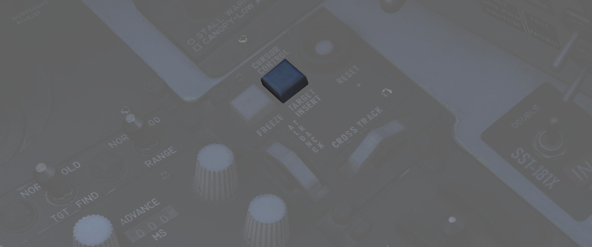

# 模式

在指定目标之前，必须先目视捕获大致的目标区域，并将 LOS 置于附近。这通过使用三种捕获模式中的一种来实
现：

- 12-VIS
- 9-VIS
- WRCS

这些模式由 WSO 通过捕获模式开关选择。

## 目视模式

在 12-VIS 和 9-VIS 模式中，LOS 被设置在固定位置。

- 12-VIS: 0 度横滚，-2 度仰角，指向略微向下
- 9-VIS: -90 度横滚（CW），-90 度仰角（向下），左视

12-VIS 是寻找随遇目标的好方法，因为它允许飞行员将机头指向目标。其位置也与锁定的 HUD 准星相对应。此
外，如果将 INS 与吊舱一体化在一起，12-VIS 还能实现横滚稳定。

9-VIS 的使用非常有限。它的目的是在飞机转弯观察区域时帮助捕获目标。目标必须放在左侧机翼的延长线上。
然而，在实践中很难保持这种姿态转弯。

## WRCS 模式

WRCS 模式为捕获目标的主要模式，其中 LOS 设置为当前的 WRCS 目标——通常与雷达屏幕上的光标相对应，但也
可由 WSO 手动设置。这样，机组人员就可以通过雷达或输入已知坐标来发现目标或指向大致目标区域，然后将吊
舱转动到该目标。如果没有插入特定目标，WRCS 通常会默认为飞机位置，使吊舱正指下方。

> 💡 当 WRCS 一体化被停用后，系统将自动从 WRCS 模式退回至 12-VIS 模式。

## 跟踪模式

一旦目标，或大致的目标区域，通过使用捕获模式被找到，WSO 可通过按下天线手控上的扳机至第一段或第二段
来进入跟踪模式。

在这种模式下，可以移动天线手控杆来移动吊舱 LOS。WSO 只能在这种模式下操作激光，可以通过按下天线手控
杆上的扳机第二段来照射。

T0 和 TTG 提示在显示器上可见时表示进入跟踪模式。它们还用于指示操作激光期间的状态。

如果 INS 与吊舱一体化，图像将自动空间稳定在计算的目标位置上。注意，这种稳定功能很初级，需要不断用手
控杆进行修正，才能使目标保持在十字中心。

稳定主要是基于测量的斜距。通过发射激光可以获得精确的斜距。或者，它也可根据飞机气压高度和目标高度来
计算得出——可由 WSO 在 WRCS 面板上设置。

没有 WRCS 一体化，系统则将假定目标高度为 0，这将导致稳定性能降低。

> 💡 吊舱不能计算高于本机高度的目标的斜距(例如当目标位于相对本机更高的山坡上时)。由于斜距是根据气压
> 高度测量的，取决于气压设置，这可能导致在炎热天气低空飞行时吊舱变得飘忽不定。碰到这种情况通常被称
> 为 _白痴模式_，因为跟踪系统开始表现得非常奇怪，很难恢复到正常行为。机组人员经常不得不暂时停用 INS
> 一体化，从而禁用自动跟踪。

## 记忆模式

只要发送了目标插入信号，当前处于跟踪模式并且 WRCS 一体化处于激活状态，系统就会激活记忆模式。

在这种模式下，即使目标在吊舱环架限制之外且目前无法显示，吊舱视线都将隶属至当前 WRCS 目标。该模式与
WRCS 捕获模式非常相似。

WSO 必须通过按下天线手控上扳机第一或第二段来再次正确离开记忆模式。

### 目标插入

目标插入信号通常由 WSO 按下目标插入按钮启动。

然而，当吊舱目前处于跟踪模式并转动至其环架限制外时，它将自动发出目标插入信号并将其当前目标位置发送
给 WRCS。

> 💡 如果激光正在照射，系统会在到达某一极限后将自动停止照射。

目标插入信号还将使吊舱进入记忆模式，在这种情况下，镜头将继续跟随 WRCS 现在存储的位置。

此外，如果取消选择吊舱，信号也将被发送，即.

- 视频选择按钮 - 武器或
- WSO DSCG 模式 - 非 TV 模式(例如切换到雷达模式)
