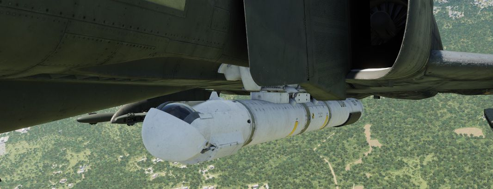
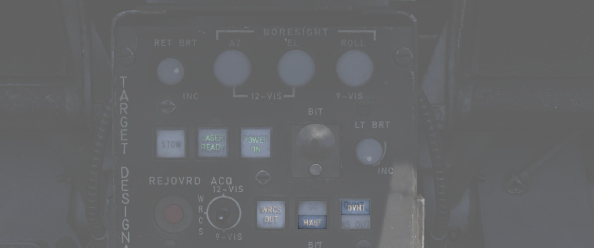
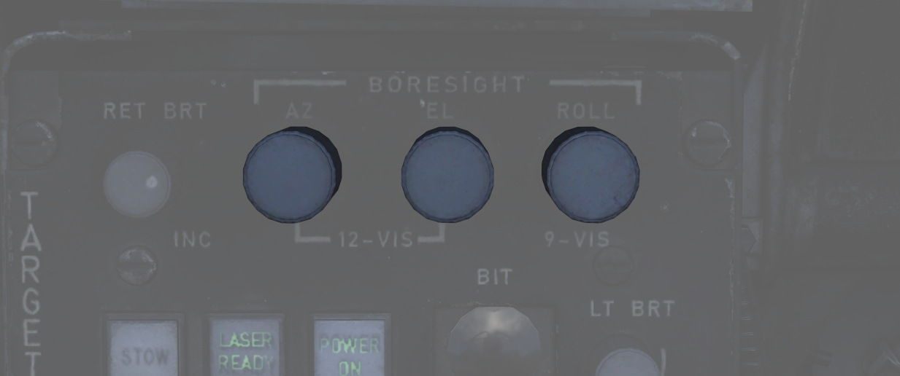
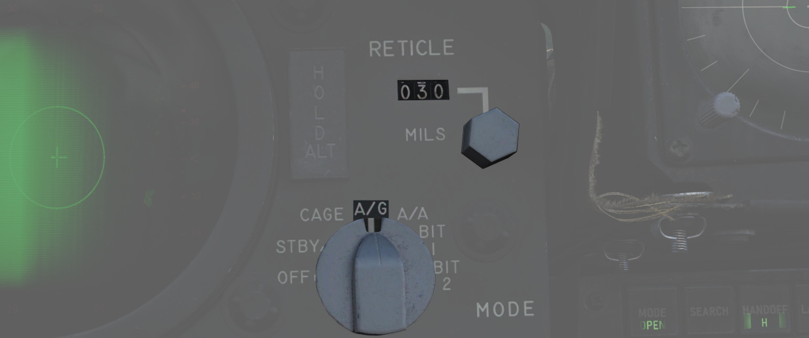
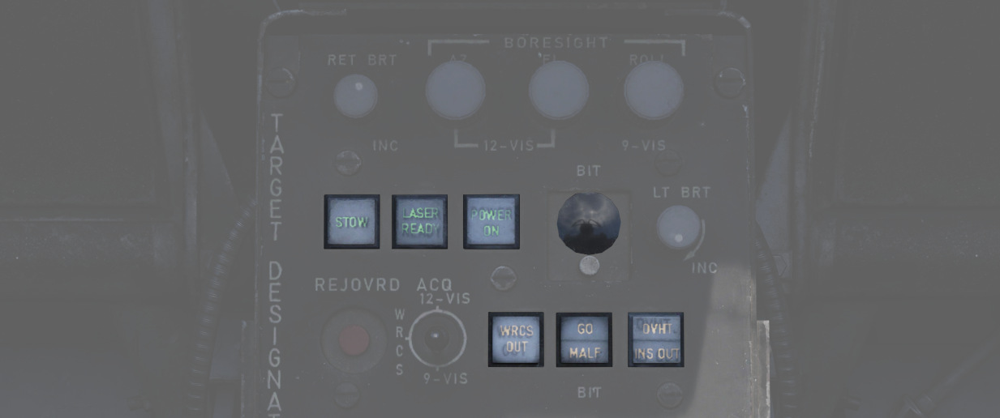
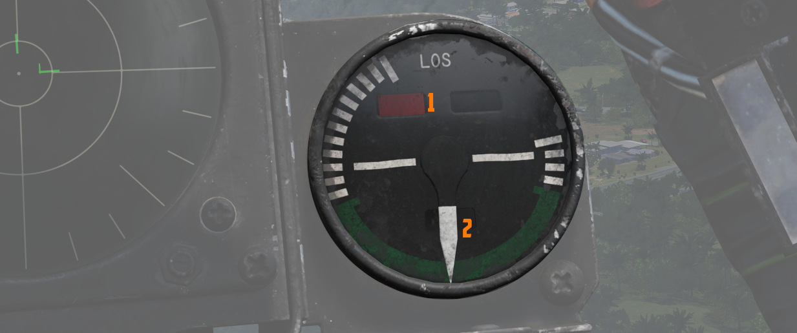
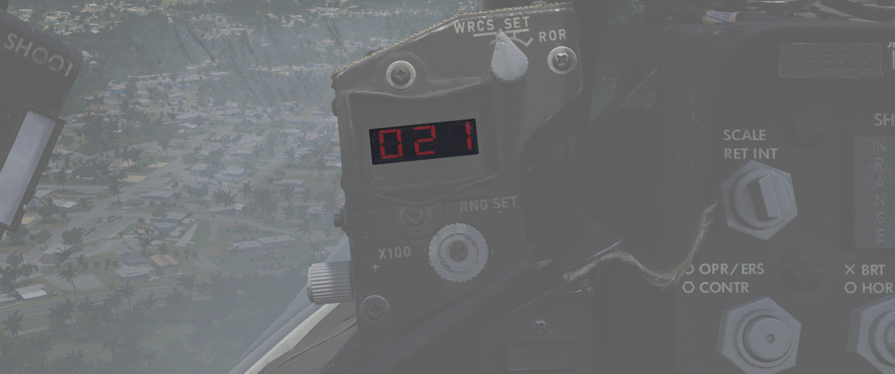

# 其它

## 收起镜头

打开系统后，按下 STOW 按钮即可伸出镜头。

伸出镜头时，吊舱根据当前选择移动，并自动进入宽视场模式。

在收起位，镜头转动至朝上，保护盖移动至镜头前。这可以避免在滑行、起飞和低空飞行时免受石块和其它危险
源损坏镜头。

收起过程需要约 5 秒钟完成，指示灯会显示当前状态。

> 🟡 注意：系统通过电力将镜头保持在收起位，没有电源则无法保持。在未通电的情况下，吊舱会受力而自由摆
> 动。在未先给吊舱通电的情况下起飞，或在吊舱断电的情况下飞行，将导致吊舱离开收起位。在收起位外，系
> 统将因异物或其它原因被强行将其移动到环架的极限位置而受损。这种损伤不仅会导致瞄准轴位置偏移，还会
> 影响其它属性，如移动速度等。

## 冷却系统

瞄准吊舱后部安装有冷却系统，可利用外部气流自动冷却吊舱。

一般来说，在所有正常操作过程中，系统都能将吊舱温度控制在限制内。

但是，如果温度失控，过热灯将会亮起。

在这种情况下，确保立即关闭吊舱，并给它一些时间进行冷却。忽视指示灯会导致吊舱的部分融化，对其造成不
可逆的损伤。

MALF 灯亮起和显示器全黑通常表示吊舱受损。

为了延长吊舱使用寿命和防止过热，不要低速和低空飞行，以及连续使用激光。

> 🟡 注意：根据经验法则，在两次使用之间不进行冷却的情况下，不要使用激光超过 15 分钟。在操作吊舱时，
> 持续低空低速飞行的时间不要超过 30 分钟。 对于极端的外部温度，请相应地调整限制。

## 瞄准轴

通常情况下，Pave Spike 会在机组登机前由地勤人员进行正确校正，但由于战损或大过载机动，系统可能出现漂
移，此时可能需要由 WSO 在飞行中进行重新校正。

因此，目标指示器控制面板提供了三个旋钮，用于在三轴（方位、俯仰和滚转）方向上调整瞄准轴的位置，各个
轴的调整范围为 ±2.5 度。

在理想条件下，吊舱校靶至平行于飞机基准线。然而，由于没有校正参考，WSO 只能实现粗略对准。

首先，光学瞄准具应切换至 A/G 模式，并使准星下压约 30 密位。在此设置下，正确的瞄准轴位置与准星的交点
距离在约 20000 英尺至 60000 英尺处（距离显示上显示为 200 至 600）。

 接下来，必须操纵飞机将瞄准具
准星指向并保持在一定距离的物体上，例如建筑。

当飞行员将准星对准物体时，WSO 需将吊舱切换至 12-VIS 捕获模式，进入窄视场，并可调整方位和俯仰来让吊
舱对准物体。

> 💡 由于吊舱安装在左侧挂点，WSO 需要将瞄准轴向准星左侧偏置几英尺来校正到正确位置。

在飞行中很难对滚转轴进行对准；如可能的话，先着陆。接着，将捕获模式开关拨至 9-VIS 并使用横滚旋钮来将
吊舱大致对准远处人站着的高度上。

或者，WSO 可在飞行中通过将捕获模式开关切换至 WRCS 模式、进入 WRCS 吊舱一体化和擦除所有当前目标输入
来实现粗略滚转对准。完成后，吊舱将自动看向正下方。

随后可将飞机直接飞至地标（如河流）正上方，并使用横滚旋钮将视线对准地标。

## 机内自检

吊舱有 5 个机内自检，BIT 1 是在正常操作期间使用的实际模式。WSO 可以通过点击显示器下方的 BIT 按钮来
激活和切换 BIT。GO/MALF 灯显示 BIT 的结果:

- GO - 自检成功
- MALF - 检测到故障

在正常操作期间，通过激活 BIT 1 将保持两盏灯熄灭。

### BIT 0

目标指示器套件控制上的所有灯都以最大亮度亮起。BIT 0 不需要为吊舱通电。

GO/MALF 灯在此模式下不指示测试结果。

### BIT 1

回路通电并进行监控。如果任何电压读数异常，MALF 灯将亮起。

GO 灯指示在此模式下不亮起。

这是标准的工作模式。吊舱可以正常使用，系统会持续监控吊舱状态。

### BIT 2

系统将模拟跟踪功能，模拟所有输入、高度和距离数据。

约 15 秒后，测试完成，GO 或 MALF 灯将亮起。

> 💡 要成功完成测试，飞机必须保持静止，吊舱必须处在伸出状态，INS 必须一体化。

### Bit 3

这是对激光能量水平的测试。吊舱将移动到一个特殊的位置来指向内部，之后对安装在吊舱内部的一个特殊传感
器照射激光。

吊舱必须处于伸出状态，必须输入有效的激光编码，并按下激光就绪按钮。在测试期间系统将忽略前轮保护，允
许在地面上使用激光。

一旦吊舱转到测试位，WSO 必须按下并按住断开/超控按钮来开始照射激光。当松开按钮后，激光将停止照射。

当照射激光后，系统将开始一个 5 秒的测试程序，传感器测量激光能量。在 5 秒的测试完成后，GO 或 MALF 灯
亮起，指示是否高于所需的最低能量水平。

飞行员可以通过方位角-仰角指示器(1 和 2)帮助告知 WSO 吊舱是否已到测试位。

### Bit 4

系统通过输入一个 2100 英尺(±200)的模拟激光斜距来测试测距计算功能。飞行员可以通过距离指示器的读数来
确认。

大约 8 到 14 秒后，测试完成，GO 或 MALF 灯亮起。

## 升级

根据机组反馈，Pave Spike 瞄准吊舱获得了两个主要升级——可作为单独的武器挂载在 DCS 中选用。

### 智能跟踪

TCTO 518，被称为 Smart-Track 升级，旨在计算出的斜距通常过于不准确的情况下，不再需要按下断开/超控按
钮来强制使用激光测量的斜距。

升级后，在吊舱视线仰角高于-7.5 度时，系统将自动接受激光斜距，即在小角度，比如在 12-VIS 模式或低空攻
击时使用吊舱。

### 快速跟踪

普遍升级项目 TCTO 519 全面改进了吊舱环架电机，将移动速度从每秒 15 度提高到每秒 60 度。

> 💡 在这个速度下，瞄准吊舱能够在低空高速飞行期间跟踪目标，例如在 1000 英尺以 500 节的空速飞越目标
> 。
