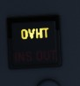
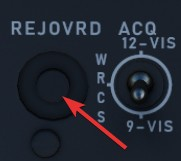

# Other

## Stowing

After turning on the system, the pod can be un-stowed by pressing the STOW push
button.

When un-stowed, the pod moves according to the current selections and
automatically goes into the WIDE FOV.

In the stowed position, the camera is rotated upwards and a cover is moved in
front of it. This protects the camera from stones and other hazards during taxi,
takeoff or low level flight.

The stow-procedure takes about 5 seconds, with the light indicating the current
status.

>💡 The stow-position is held electrically and can not be held without
> power. Un-powered, the pod swings freely with force. Taking off without first
> applying power to the pod, or flying with the pod being powered off, will cause
> the pod to leave the stow position. Outside of the stow position, the system
> will get damaged through hazards and whenever it is forcefully moved into its
> gimbal limits. Damage will not only offset the boresight position, but also
> affect other properties, such as movement speed and similar.

## Cooling

The targeting pod has a cooling system installed in the rear section, which
automatically cools the pod by external airflow.

In general, the system is capable of keeping the pods temperature within limits
during all normal operation.

However, if the temperature gets out of control, the Overheat lamp will
illuminate.

In this case, make sure to turn off the pod immediately and give it some time to
cool down first. Ignoring the lamp will cause parts of the pod to melt, damaging
it irreparably.

A broken pod is generally indicated by the MALF lamp going on and the display
being all black.

To prolong use of the pod and prevent overheating, limit slow and low-level
flight, as well as continuous use of the laser.

> 💡 As a rule-of-thumb, do not use
> the laser for longer than 15 minutes without allowing for cooling between uses.
> Limit continued slow and low level flight while operating the pod to 30 minutes.
> For extreme outside temperatures, adjust the limits accordingly.

## BITs

The pod has 5 built-in tests, with BIT 1 being the actual mode used during
normal operation. They can be activated and switched through by clicking the BIT
button below the display. The GO/MALF lights show the result of the BIT:

- GO - test was successful
- MALF - test detected a failure

During normal operation, activated through BIT 1, neither of the lights are
illuminated.

### BIT 0

All lights on the Target Designator Set Control illuminate with full brightness.
The pod does not need to be powered up for this test.

GO/MALF do not indicate test results in this mode.

### BIT 1

The circuits are energized and monitored. If any voltage reading is abnormal,
MALF illuminates.

GO does not illuminate in this mode.

This is the standard operational mode. The pod can be used normally and the
system will continuously monitor the status.

### BIT 2

The system simulates track functionality, simulating all inputs, altitude and
range data.

After about 15 seconds, the test is finished with either GO or MALF
illuminating.

> 💡 For the test to be successful, the aircraft must not be moving, the pod must be
un-stowed and INS must be integrated.

### Bit 3

This tests the laser energy level. The pod moves to a special position where it
looks inside itself, such that the laser fires against a special sensor mounted
inside the pod.

The pod must be un-stowed and a valid laser code must have been entered, as well
as the LASER READY button being pushed in. The nose gear guard is ignored during
the test, allowing the use of the laser on ground.

Once the pod has reached the test position, the WSO must press and hold the
Reject/Override button to start firing the laser. The laser stops firing when
the button is released.

When the laser fires, a 5 second test program starts, with the sensor measuring
the laser energy. After the 5 second test, either GO or MALF illuminate to
indicate whether the energy level was above the required minimum.

To pilot can assist in telling the WSO that the test position has been reached,
as indicated by the Azimuth-Elevation Indicator.

### Bit 4

The system tests the ranging computation by feeding a simulated laser slant
range of 2100 ft (±200). The pilot can confirm this using the Range Indicator
readout.

After about 8 to 14 seconds, the test is finished and either GO or MALF is lit.

## Upgrades

Based on crew feedback, the Pave Spike targeting pod received two major
upgrades, which are available as separate selectable weapon in DCS.

### Smart-Track

TCTO 518, known as the Smart-Track upgrade, aims at removing the requirement to
press the Reject/Override button to force the laser measured slant range in
situations in which the computed slant range was usually too inaccurate.

With the upgrade, the system will automatically accept the laser slant range
whenever the pods elevation gimbal is above -7.5 degrees. I.e. in shallow
angles, for example during 12-VIS mode or low altitude attacks.

### Fast-Track

The popular upgrade TCTO 519 overhauls the pods gimbal motors, increasing the
movement speed from 15 dps to 60 dps.

> 💡 At this speed, the targeting pod is capable of tracking a target during low
altitude high speed flight, such as overflights at 1,000 ft with 500 knots.

## Checklists

For Checklists see the [Pave Spike procedure chapter](../../../procedures/pave_spike.md#turn-on).
