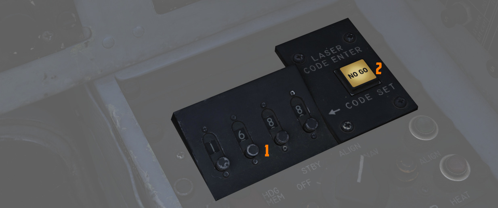
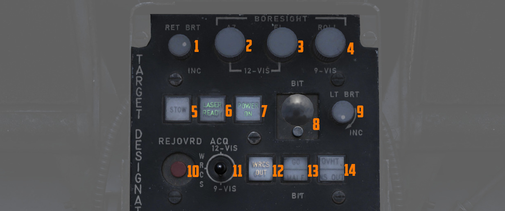

# Pave Spike

AN/AVQ-23 Pave Spike 瞄准吊舱是 AN/AVQ-10 Pave Knife 的后继型号，也是 AN/AVQ-26 Pave Tack 吊舱的前
身。AN/AVQ-23 于 1974 年开始服役，1982 年至 1989 年被 Pave Tack 吊舱取代。AN/AVQ-23 为机组提供可移
动 TV 图像来搜索地面目标，并可发射激光来取得距离信息和为激光制导武器提供制导。

WSO 可使用天线手控来控制视线。镜头图像显示将在 DSCG 显示器上，飞行员和 WSO 均可各自独立查看图像。

## 瞄准吊舱

该系统有一个用于昼间操作的光学镜头，具有一级光学变焦，可提供宽视场和窄(4 倍)视场。

吊舱环架的限制为

- 横滚: -160 度至+110 度
- 俯仰: -160 度至+15 度
- 偏航: -15 度至+15 度

## 标识符

TV 图像主要由一个十字准星组成十字准星顺时针旋转以指示吊舱当前的仰角。旋转 90 度时，吊舱是垂直向下。
如果十字准星几乎翻转，吊舱达到了仰角(160 度)的环架极限。

宽视场模式由一个包围十字准星的圆环指示。

在左边，图像显示了两个提示符:

- 剩余时间 (TTg)
- 投放提示 (T0)

在武器操作过程中，TTg 向下移动直到与 T0 相交，TTg 最长指示 15 秒剩余时间。

这些提示符还指示与激光操作有关的各种状态。

| 指示     | T0                     | TTG                  |
| -------- | ---------------------- | -------------------- |
| 不显示   | 未进入跟踪模式         | 未进入跟踪模式       |
| 常亮     | 指令照射激光(二段扳机) | 照射激光，距离有效   |
| 快速闪烁 | 未指令激光照射         | 未照射激光或目标太远 |
| 慢速闪烁 |                        | 照射激光，但距离无效 |

## 控制开关/按钮

Pave Spike 主要由 WSO 操作，而飞行员则有指示器协助，将吊舱视线保持在环架限制内。

整个系统被称为 AN/ASQ-153 光电目标指示系统，包括:

- 距离指示器(飞行员)
- 方位-仰角指示器(飞行员)
- 激光编码器控制(WSO)
- 目标指示器套件控制(WSO)

而图像可显示在两个驾驶舱的 DSCG 屏幕上。

 _(<num>1</num>) 距离指示器,
(<num>2</num>) 亮度控制旋钮, (<num>3</num>) DSCG 显示器, (<num>4</num>) 方位-仰角指示器,
(<num>5</num>) 武器选择旋钮_

 _(<num>1</num>) 视频选择按钮,
(<num>2</num>) DSCG 显示器, (<num>3</num>) DSCG 控制旋钮, (<num>4</num>) 目标指示器控制开关/按钮,
(<num>5</num>) 激光编码器控制, (<num>6</num>) 天线手控_

### 方位-仰角指示器

方位-仰角指示器是飞行员评估吊舱当前姿态的主要仪表，来保持吊舱视线处在操作限制内。

指针显示吊舱的横滚角，显示区间从 -160° (顺时针) 到 +110° (逆时针) 。

有三枚旗帜用来指示仰角：

- 绿: -120 至-155 度- 黄:-155 至-160 度- 红:-160 或更高度数

> 💡 如果指针保持在绿区内，且未显示黄旗或红旗，那么镜头未被吊舱本身或飞机遮挡。

### 距离指示器

面板为飞行员提供由 Pave Spike 瞄准吊舱测得的斜距读数 (x100 英尺)。

按下测试按钮后 (<num>3</num>)，屏幕将显示 888。测试按钮下方的旋钮 (<num>5</num>) 用于控制读数的亮度
。

模式旋钮(<num>1</num>)允许飞行员选择其中一个吊舱可用的武器投放模式：

- WRCS - 自动投放- ROR - 距离投放

SET 档位，屏幕将显示 ROR 模式使用的预计投放距离。在读数下方旋钮(<num>4</num>)可用于调整距离。

### 激光编码器控制

WSO 可以通过面板上的四个小按钮(<num>1</num>)设置瞄准吊舱使用的激光编码。每按一次，相应的数字将加一
。设置好编码后，按下右侧的 ENTER 按钮 (<num>2</num>) 即可将其传输至 Pave Spike。

验证输入的编码大约需要 5 秒钟。如果 NO-GO 指示灯亮起，则表示编码无效。

> 💡 编码与激光频率直接相关，因此编码必须介于 1111 和 1788 之间，并且无数字 0 或 9 才能生效。

系统通电后，会自动开始传输当前设置的编码。

### 目标指示器套件设置

这是与 Pave Spike 瞄准吊舱进行交互的主面板 。

从左到右，从上到下，它为 WSO 提供:

- 十字亮度旋钮(<num>1</num>) -将十字从黑色调整为绿色- Az/El/Roll 瞄准轴旋钮
  (<num>2</num>,<num>3</num>,<num>4</num>) - 在 ±2.5 度范围内调整瞄准轴位置- STOW 按钮
  (<num>5</num>) - 伸出和收起吊舱镜头- 激光就绪按钮(<num>6</num>) - 开启或解除激光保险- 通电按钮
  (<num>7</num>) - 打开或关闭吊舱- 当前选择的 BIT，按下按钮(<num>8</num>)来进入所需的 BIT 模式- 亮
  度旋钮(<num>9</num>) - 控制该面板上所有灯光的亮度，过热灯除外。- 断开/超控按钮(<num>10</num>) -
  强制使用激光测得的斜距。- 捕获模式开关(<num>11</num>) - 选择捕获模式（12-VIS、WRCS 或 9-VIS）-
  WRCS 脱机按钮(<num>12</num>) - 手动断开或接通 WRCS 与吊舱一体化- GO/MALF 灯(<num>13</num>) - 指示
  BIT 结果- INS 脱机（和过热灯）(<num>14</num>) - 断开或接通 INS 与吊舱一体化

指示灯一般指示当前状态，而按下按钮可以当作手动指令使用。例如，按下激光就绪按钮并不足以使激光真正准
备好。只有满足所有其它条件，例如设置有效的激光编码，指示灯才会亮起。

### 天线手控

在跟踪模式下，WSO 可以用天线手控（天线杆）手动移动和修正吊舱的视线。

问询按钮(<num>1</num>)用于放大或缩小视场，而二段扳机(<num>3</num>)用于在模式之间切换并照射激光。拨
轮 (<num>2</num>) 在使用 Pave Spike 是无功能。

> 💡 控制逻辑 **不是** 反转的。向后拉动天线杆会向上移动视线(_pitch up_)。

> 💡 吊舱计算能力十分有限，不要将十字移动至飞机基准线上方（上视）否则控制开关/按钮将会反转并且吊舱
> 将无法正确计算目标坐标。

在使用 Pave Spike 时，比起雷达或还有其它飞机，扳机的功能将有些许不同。如需照射激光，不是按住扳机，
而是完成整套动作序列并在扳机所有段之间来回移动，即，从 _Released_ 到 _第一段_ 到 _第二段_，回 _第一
段_ 并 _松开_。完成这一动作序列将切换激光开关。如需进入跟踪模式，玩家必须完成动作序列 _松开_ 到 _第
一段_ 并返回 _松开_。在时刻按住扳机不会执行关联的动作。

> 💡 我们提供的按键确保正确地执行动作序列。对于物理第二段扳机，使用对应的第二段绑定。
