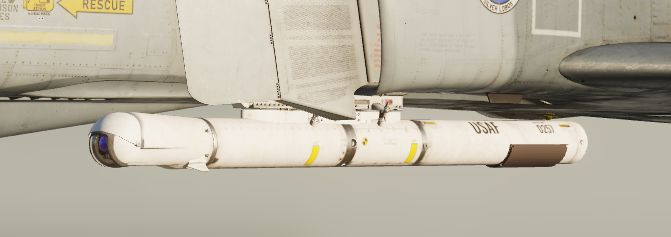

# Pave Spike

The AN/AVQ-23 Pave Spike targeting pod is the successor of the AN/AVQ-10 Pave
Knife and predecessor of the AN/AVQ-26 Pave Tack pod. It entered service in 1974
and was replaced from 1982 to 1989 by the Pave Tack pod. It provides a slew-able
TV image for spotting ground targets and can fire laser for determining range
information and to guide laser guided weapons.

The line of sight can be controlled by the WSO, using the Antenna Hand Control.
The camera image is displayed on the DSCG scope and can be viewed by both, the
Pilot and the WSO independently.

## Targeting Pod

The system has an optical camera for daylight operation with one level of
optical zoom, for a wide and narrow (4x) field of view.

Limitations for the pods gimbals are

- Roll: -160 to +110 degrees
- Pitch: -160 to +15 degrees
- Yaw: -15 to +15 degrees

## Symbology

The TV image mainly consists of a reticle. The reticle rotates clockwise to
indicate the pods current elevation. At a 90 degree rotation, the pod is looking
straight down. If the reticle is almost upside down, the pod reached its gimbal
limit for the elevation (160 degrees).

The wide field of view is indicated by a circle around the reticle.

On the left, the image displays two cues:

- Time To Go Cue (TTg)
- Release Cue (T0)

During weapon operation, TTg moves down until it intersects T0, indicating the
time to release from maximally 15 seconds.

The cues also indicate various situations related to laser operation.

| Indication    | T0                                    | TTG                                     |
| ------------- | ------------------------------------- | --------------------------------------- |
| not shown     | not in TRACK mode                     | not in TRACK mode                       |
| steady        | commanded to fire laser (full action) | firing laser, accepted range            |
| flashing fast | not commanded to fire laser           | not firing laser or target too far away |
| flashing slow |                                       | firing laser, but range rejected        |

## Controls

The Pave Spike is mostly interacted with by the WSO, while the Pilot has
indicators assisting in keeping the pods line of sight within its limits.

The entire system, known as AN/ASQ-153 Electro-Optical Target Designator System,
consists of:

- Range Indicator (Pilot)
- Azimuth-Elevation Indicator (Pilot)
- Laser Coder Control (WSO)
- Target Designator Set Control (WSO)

While the display is shown on the DSCG screens in both cockpits.

### Azimuth-Elevation Indicator

The Azimuth-Elevation Indicator is the main instrument for the pilot to assess
the pods current attitude in order to keep the line of sight within the
operational limits.

The needle shows the pods roll position from -160 (CW) to +110 (CCW) degrees.

Three flags indicate the elevation:

- green: -120 to -155 degrees
- yellow: -155 to -160 degrees
- red: -160 or beyond degrees

If the needle is kept within the green labelled range and neither the yellow or
red flag are shown, the view will not be obstructed by the pod or the aircraft.

### Range Indicator

This panel provides the pilot with a readout of the slant range measured by the
Pave Spike (x100 ft).

When the Test-Button is pressed, the display shows 888, the knob underneath it
controls the brightness of the readout.

The Mode-Knob allows the pilot to select one of two weapon delivery modes
available with the pod:

- WRCS - Automatic Delivery
- ROR - Release on Range

In the SET position, the display shows the desired release range used in the ROR
mode. The knob below the readout can be used to adjust this range.

### Laser Coder Control

The WSO can set the laser code used by the targeting pod by using the four small
push-buttons on this panel. Each press will advance the corresponding digit by
one. Once a code has been set, it can be transferred to the Pave Spike by
pressing the Enter-Button to the right.

The Laser Coder system starts validating the entered code, this process takes
about 5 seconds. If the NO-GO lamp is lit, the code is invalid.

Codes directly relate to lasers frequencies, resulting in them having to be
between 1111 and 1788 and not use digits 0 or 9 in order to be valid.

When power is applied to the system, it automatically initiates a transfer of
the currently set code.

### Target Designator Control Set

This is the main panel to interact with the targeting pod.

From left to right, top to bottom, it provides the WSO with:

- Reticle Brightness Knob - change the reticle from black to green
- Az/El/Roll Boresight Knobs - adjust the boresight position of the pod within
  ±2.5 degrees
- Stow Button - Stow or Un-stow the pod
- Laser Ready Button - Arm or Disarm the laser
- Power On Button - Turn the pod on or off
- Currently selected BIT, with push button to advance the BIT
- Light Brightness Knob - adjust brightness of all lights on this panel (except
  the Overheat lamp)
- Reject/Override Button - Force the use of the laser slant range
- Acquisition Mode Switch - Select the Acquisition Mode (12-VIS, WRCS or 9-VIS)
- WRCS Out Button - Toggle WRCS integration with the pod
- GO/MALF Lamp - Indicates BIT results
- INS Out Button (and Overheat lamp) - Toggle INS integration with the pod

The lamps generally indicate the current status, while the push buttons can be
used as a manual command. For example, pressing the Laser Ready Button is not
enough for the laser to actually be ready. The lamp will only be lit if all
other conditions, such as a valid laser code being set, are met.

### Antenna Hand Control

During Track mode, the WSO can manually slew and correct the pods line of sight
with the Antenna Hand Control, or Antenna Stick.

The Challenge Button is used to zoom in or out, while the 2-stage trigger is
used to switch between modes and fire the laser.
