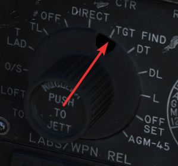
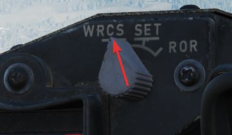
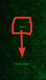
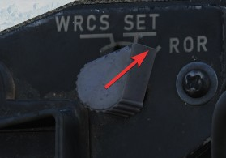
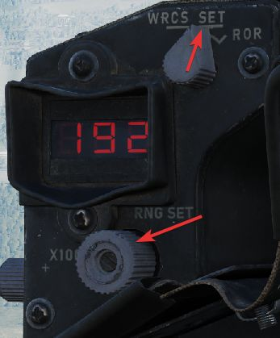
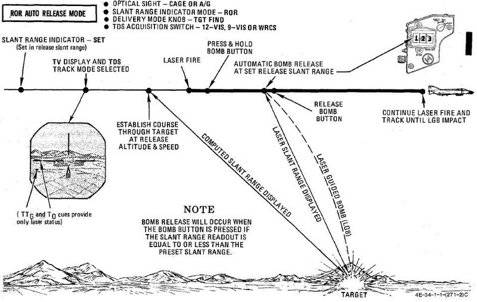

# 武器投放模式

吊舱还提供额外两种武器投放模式：

- WRCS 自动模式
- ROR（到距离投放）

## 自动模式

WRCS 自动投放模式是吊舱的主要武器投放方式。

WRCS 必须与吊舱一体化后才能使用，飞行员必须选择 TGT FIND 作为投放模式，并在距离指示器上选择 WRCS。

该模式的工作原理与 WRCS 的俯冲改出模式相同，只是它将使用吊舱计算出的斜距和目标。

TTG 提示符会向下移动并与 T0 提示符相交，TTg 最长指示 15 秒剩余时间。

## ROR

到距离投放主要作为备份模式。飞行员必须选择 TGT FIND 作为投放模式，并在距离指示器上选择 ROR 来使用
ROR。

当计算的斜距小于设定的预计投放距离后，系统将自动投放武器。预计投放距离可在距离指示器上配置，通过将
模式设置为 SET 并转动显示器下方的旋钮。

平飞时投放效果最佳。

