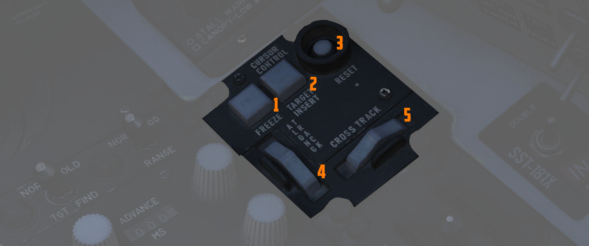

# Weapon Release Computer Set (WRCS)

Provision for the F-4E to perform accurate level and dive munition delivery is
provided by the AN/ASQ-91 WRCS. The WRCS inputs are set with the associated
panels in the cockpits, and these commands, along with INS data and radar target
ranging, are used by the ballistic computer to provide the release signal.

## Target Range Controls

The Computer Control Panel found in the rear cockpit has three TARGET entry
controls, two RELEASE entries, and a bomb DRAG COEFFICIENT entry setting, as
well as a BIT control knob for system function check. Target entry is relative
to the predetermined IP.

The upper range control input is for North/South, and selection of relative
bearing is noted by the N or S prefix at the start.

The middle range control input is for East/West, and like the previous, the E or
W prefix on the range sets the relative bearing direction.

The final ALT RANGE entry is for target altitude- whether the target or RIP
(Radar Identification Point) elevation as MSL, or the target/RIP's pressure
altitude.

Entries for North/South and East/West are in 100 foot increments, and a maximum
value of up to 99,900 feet may be entered for these distances. The ALT RANGE
entry has a maximum of 24,900 in 100 foot increments. Note that the WRCS can be
damaged if the ALT RANGE entry is greater than the aircraft's current MSL (x100)
in TGT FIND and OFFSET BOMB modes.

## Release Range Control

The Release Range control is used to manually set bomb range in tens of feet,
and is accessible in the Laydown, Dive Laydown, and Offset Bombing modes. The
maximum setting is 9990 feet (999x10), and when used in a WRCS/AJB-7 integrated
delivery, the actual range can be as high as 99,900'.

The Rg control should not be set to the same value as the target range control.
Otherwise, the bomb rack delay may release late, or not at all.

## Release Advance Control

Operative in all WRCS and WRCS/LABS integrated motes, the Release Advance
Control works in conjunction with the AWRU to advance the release signal in
milliseconds. Whereas the AWRU Intervalometer setting triggers the release pulse
sequence from the moment the bomb release button is pressed, when the Release
Advance Control is applied in a WRCS driven delivery, the specific bomb location
in a multiple ripple sequence can be calculated in advance, allowing the most
effective spread possible across a given target.

As an example, an AWRU single-ripple quantity release of 4 is selected with an
interval of 120 milliseconds. To place the third bomb in the ripple on target,
the following equation is used:

\\[ RA = I_R \cdot (N_{Tgt} - 1) \\]

where

- \\( RA \\) = Release Advance Setting, milliseconds
- \\( I_R \\) = AWRU Release Intervalometer setting, milliseconds
- \\( T\_{Tgt} \\) = Impact Sequence number of bomb desired on target

\\[ RA = 120 \cdot (3 - 1) \\]

Thus, for this release, we would set the value of RA to 240 msec. This would
produce a spread of two bombs ahead of target, one on the calculated target
point, and one behind.

The maximum setting for the Release Advance Control is 999 milliseconds. A calculator to calculate
the Release advance in-game is provided with
the [bombing calculator.](../../dcs/bombing_computer.md)

## Drag Coefficient Control

Used only in the Dive Toss Mode, this entry is a bias factor prepared for the
ballistic computer to compensate for actual bomb trajectory. The maximum setting
for this value is 9.99.

### Ballistic Computer

The ballistic computer is not directly accessed by the flight crew, but instead
pre-set based on the configured loadout by the ground crew to add the necessary
ejection bias factors. The computer uses these pre-set bias factors in
conjunction with a coefficient setting for munition drag in the Dive Toss mode to
calculate accurate delivery.

## WRCS Built-In-Test (BIT)

The BIT control is used to confirm go/no-go status of the WRCS. The BIT system
checks individual bomb modes individually, and effectivity of the given setting
is confirmed by selecting the desired mode, pushing the center of the knob PUSH
FOR BIT for five seconds, then pressing the FREEZE button in conjunction wih the
PUSH FOR BIT button. Confirmation of mode performance will be displayed as GO or
NO-GO. Should a mode be checked a subsequent time during a flight and a NO-GO
response is received, it can be disregarded.

## Cursor Control Panel

The Cursor Control Panel provides the controls needed for TARGET FIND and OFFSET
bombing modes. The panel has two wheels named ALONG TRACK and CROSS TRACK,
which is used in the MAP-PPI mode to position their respective cursors over the
Radar Identification Point (from this point denoted as RIP). The ALONG TRACK
control, which presents relative range to the RIP, also includes an internal
switch enabling the cursor instructions to be acknowledged by the WRCS ballistic
computer, and must therefore be the first applied command in the target
insertion sequence.

Once the ALONG TRACK (range hemisphere) and CROSS TRACK (vertical line) cursors
are aligned over the RIP, the FREEZE button is pressed to initiate WRCS ground
path tracking of the specified point. The button remains illuminated until the
RESET button is pressed or another bombing mode is selected.

With WRCS ground tracking initiated, the TARGET INSERT button is pressed for the
ALONG TRACK and CROSS TRACK cursors to shift from the RIP to the offset target.
Once selected, target steering information is provided from the WRCS to the
BDHI, ADI, HSI, and optical sight. In the AGM-45 missile mode, the AoA Indexers
will provide maneuver commands for level, dive, or climb requirements to align
for seeker acquisition. Further, unless the WRCS Tone switch is disabled on the
ARBCS panel, an audio tone will be triggered from the point of bomb release
button press until the first bomb releases from the aircraft; this function is
nominally for training purposes, as it can preclude other system audio volume.

## Weapon Delivery Panel

The Weapon Delivery Panel permits the aircrew to use the WRCS TGT FIND functions
in LABS (ARBCS) modes - those found on the left side of the pilot's Delivery Mode
Knob.

The TGT FIND switch on the panel functions the same as the TGT FIND mode on the
Delivery Mode Knob. The Delivery Mode Knob overrides this switch in any mode
outside of TGT FIND, and should be set back to NORM. The HOLD position energizes
the target finding circuits in conjunction with any LABS or DIRECT mode the pilot
selects.

The RANGE Switch is functional in any WRCS mode requiring a Release Range
setting. The NORM position applies the noted x10 multiplier on the displayed
Release setting, whereas selecting x100 applies a multiplier of 100 to the
counter value.

The ACTIVATE Switch triggers the prerequisite activation signals to the LABS
circuits once the aircraft has passed within the Release Range. The switch
should only be placed in ON after target insert has been pressed and the ALONG
TRACK and CROSS TRACK cursors have transitioned to the target.
