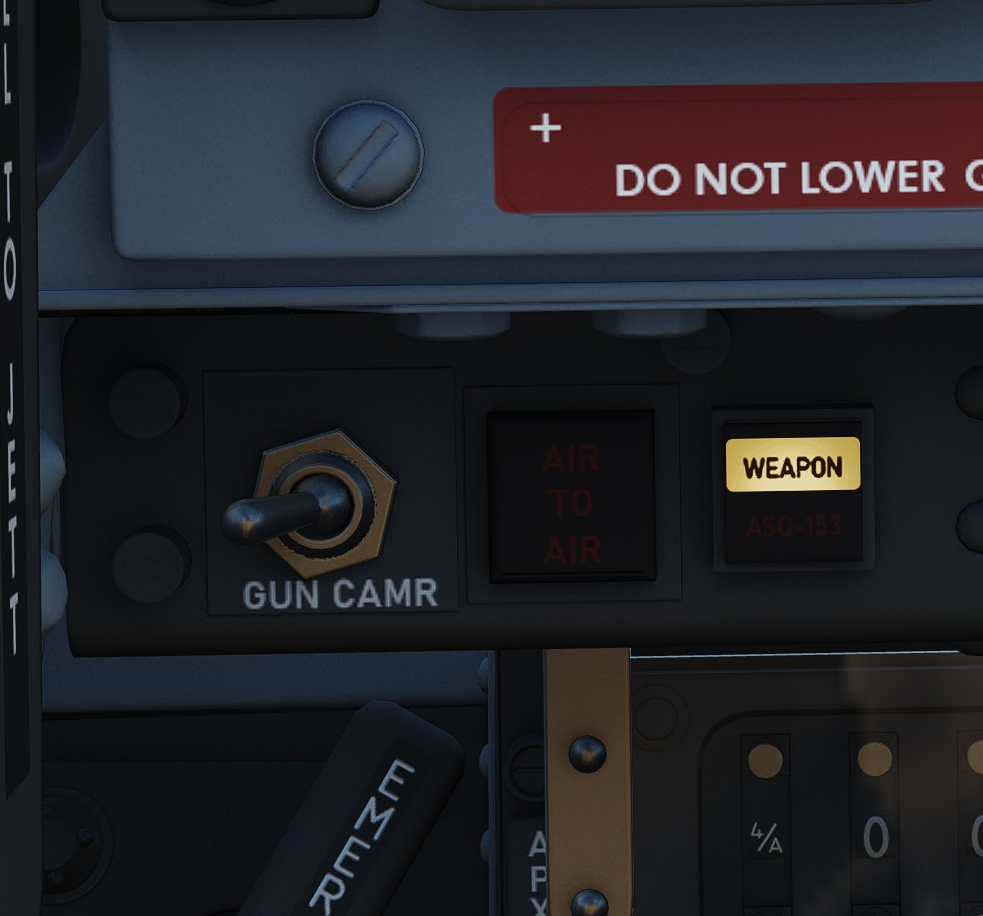
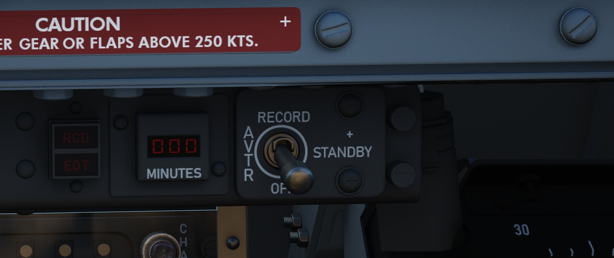
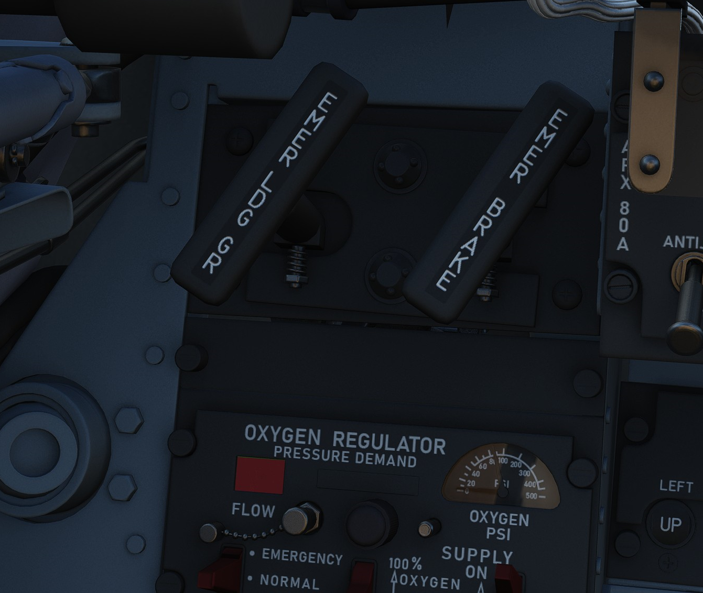
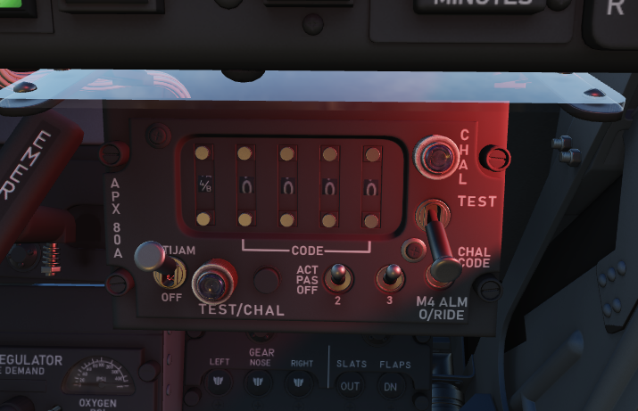
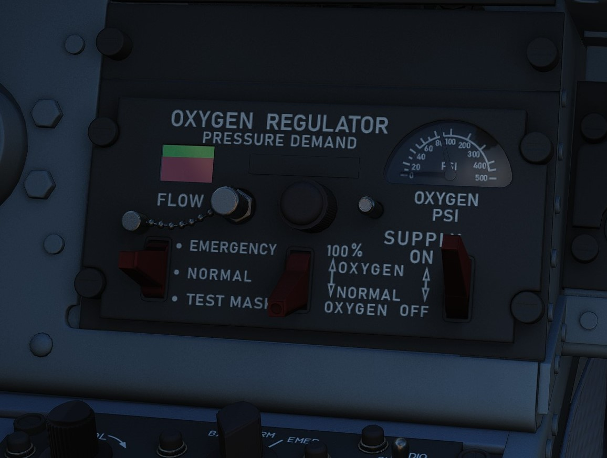
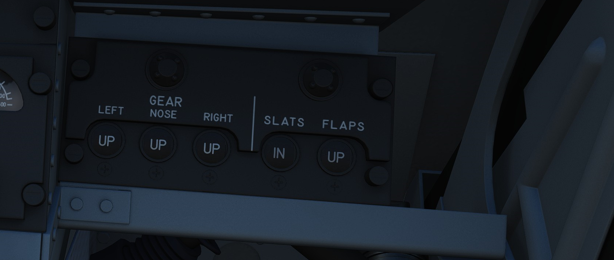
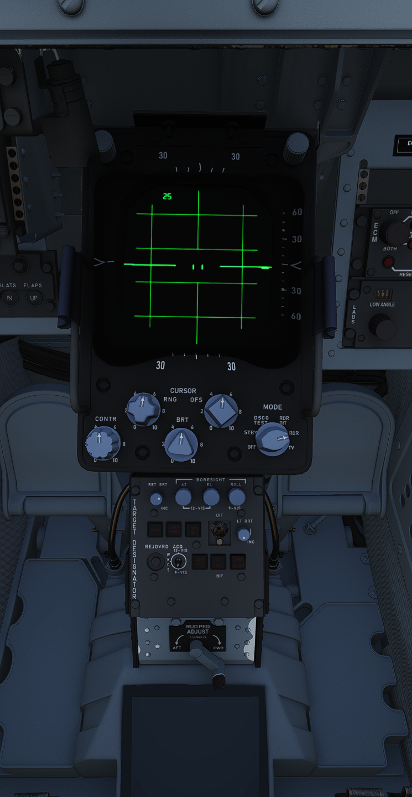
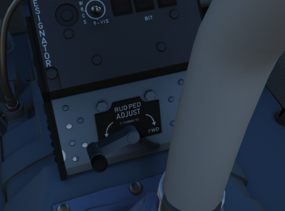

# WSO Cockpit Overview

## Layout

| Section | Name                                                   |
| ------- | ------------------------------------------------------ |
| 1.      | Upfront Indicators Group                               |
| 2.      | WSO Left Subpanel                                      |
| 3.      | WSO Left Console                                       |
| 4.      | Digital Scan Converter Group (DSCG) and Pedestal Panel |
| 5.      | WSO Right Subpanel                                     |
| 6.      | WSO Right Console                                      |

## Upfront Indicators Group

### Standby Magnetic Compass

A standard magnetic compass for backup navigation assistance should the primary
flight director systems fail.

### Command Ejection Select Handle

Used to select single or dual ejection as commanded by the WSO. In the vertical
position (valve closed), initiation of ejection by the WSO ejects only the rear
seat. With the valve handle in the horizontal (open) position, a WSO initiating
ejection will extract both crew members.

### Course Indicator

Used during an ILS approach, displays localizer and glide slope deviations
represented dots—1 dot equals 1 1/4 degrees for course and 1/4 degree for glide
slope. The heading pointer indicates the aircraft's heading relative to the
selected course set by the knob. Does not function with TACAN or VOR. OFF flags
display on signal loss.

### KY-28 Mode Indicator

Two lamp indicator illustrating current KY-28 operating mode- P indicates plain
(unencrypted) mode transmission, whereas C indicates cipher (encrypted) mode
transmission.

### Master Caution Light

A repeater of the front cockpit Master Caution light, provides warning to the
WSO that a caution condition exists and the telelight panel needs to be checked
for cause to rectify the situation.

### Shoot Light

Illuminates when missile firing parameters are met. Do not illuminate when in VI
or A-G modes.

### AN/APR-36 Control Panel

### Angle of Attack Indexer

Provides quick confirmation of current aircraft AoA state based on illuminated
position and color.

### Range (VISIDENT) Indicator

Displays accurate range information inside of 2 miles (12000') and range/rate
information inside of 9000', when lockon exists in VI, B NAR, or B WIDE mode.
When AIR-GRD is selected, the indicator is disabled.

### 8-Day Clock

A clock is provided for the WSO, including a stopwatch function.

### Accelerometer

Calibrated from negative 4 to positive 10 in units of G, with three pointers-
one for current applied load, the other two show maximum positive and negative G
applied during the flight. Pressing the PUSH TO SET button will reset the
maximum position indicators to 1 G.

### Ball/Slip and Rate of Turn Indicator

A 4-minute turn indicator, utilizing a conventional horizontally mounted gyro,
accurately displays standard turn rates, resembling a conventional turn and slip
indicator.

### Navigation Mode Selector Switch

Selects the respective mode for the two BDHI needles.

| Name   | Description                                                         |
| ------ | ------------------------------------------------------------------- |
| Up     | Needle 1: UHF/Automatic Direction Finding; Needle 2: TACAN station. |
| Center | Needle 1: VOR Station; 2 TACAN station.                             |
| Down   | Nav Computer mode: Needle 1: Bearing; Needle 2: Ground track.       |

### Ground Speed Indicator

Provides the aircraft's ground speed in knots, and is calibrated from 0 to 1999
knots. Requires INS for accurate presentation. If INS off, can register any
value of up to 150 knots when motionless on ground.

### True Airspeed Indicator

Provides the aircraft's True Airspeed in knots, and is calibrated from 150 to
1500 knots; airspeeds below this range are thus not reliable. At high rates of
airspeed change, there may be a lag of up to

### UHF Remote Channel Indicator

Provides the current selected channel value when the radio is set to PRESET.
Otherwise, the indicator displays M if the radio is set to Manual, G when the
COMM function is set as GUARD/ADF, or A when the A-3-2-T switch is in A.

### Vertical Velocity Indicator

Provides rate of climb or descent via the static pressure system referenced in
thousands of feet per minute.

### Altimeter

A counter-pointer style altimeter, with thousandths in the counter window and
100 foot increments around the face. The altimeter has an absolute range of
80,000 feet. The altimeter includes a barometric scale for setting local
pressure with the knob on the indicator. Works in either electric (normal
operation mode) or pneumatic (STBY) mode, switchable via a spring-loaded three
position switch labelled RESET and STBY.

### Attitude Indicator

The AHRS provides attitude information to the Attitude Indicator found on the
rear cockpit instrument panel when the Reference System Selector Switch is in
PRIM or STBY. A trim knob provides the ability to adjust the attitude sphere to
reference the aircraft correctly. Should power be disconnected from the
indicator or AHRS, the OFF flag will display.

### Airspeed and Mach Indicator

The combination airspeed and mach number indicator shows airspeed readings below
200 knots, and include Mach numbers at high speed. The indicator uses a single
pointer over a fixed airspeed scale, marked from 80 to 850 knots, with a moving
Mach scale presenting from Mach 0.4 to 2.5. A pair of movable reference markers
is available with the knob on the face of the gauge, with speed reference
available between 80 and 195 knots, and the Mach index pointer being able to be
set between the 225 knot and 850 knot regions relative to the airspeed gauge.

Note: Moving these reference markers outside of the respective aforementioned
regions can damage them.

### Bearing Distance Heading Indicator (BDHI)

The Bearing Distance Heading Indicator, or BDHI, presents navigation information
as entered by the WSO, provided with two needles (termed the No 1 and No 2
pointers).

When the upper position is selected by the WSO to TACAN/ADF/UHF, the no. 1
pointer indicates UHF bearing, and the no. 2 pointer indicates the TACAN
bearing. If there is no TACAN signal, both pointers indicate the ADF bearing.

With the middle position selected- VOR/TAC, the no. 1 pointer indicates the VOR
bearing, the no. 2 pointer indicates the TACAN bearing, and the range indicator
provides distance to the TACAN station. In the absence of a TACAN signal, both
pointers indicate the VOR station.

In the lower position, NAV COMP, the no. 1 pointer indicates bearing to the
navigation computer target coordinates, and the no. 2 pointer indicates magnetic
ground track. The range indicator notes distance to the target coordinates.

### Tachometers

A percentage-noting Tachometer is provided for each engine, including an inset
wheel for accurate display of single digits.

### Canopy Unlocked Warning Lamp

Illuminates when canopy is unlocked.

### Inertial Nav Sys Out Lamp

Illuminates when INS system is in a failure state.

### Radar CNI Cool Off Lamp

Illuminates to indicate an overtemperature situation in the avionics cooling
system.

## WSO Left Subpanel

### Gun Camera Switch

Activates recording of gun camera footage.

### Air to Air Light

Illuminates when CAGE mode activated; pressing the light reverts the radar to
the original operating condition prior to CAGE entry.

### Video Select Button

Push button that alternates between WEAPON and TDS pod (ASQ-153) television
video on the radar scope display when in TV mode.

### AVTR Control

Controls the Airborne Video Tape recorder system which records the intercom
sound, as well as the rear radar screen.

#### AVTR Switch

With the switch in the RECORD position, footage is recorded on the cassette and
the RCD light illuminates. The STANDBY position pauses recording, while the OFF
position will additionally automatically unthread the tape back to the beginning
after 10 seconds.

#### AVTR Tape Timer

The cassette can record up to 20 minutes of footage, indicated in the small
display labelled MINUTES.

#### EOT Light

Once the end of the tape has been reached, the EOT light illuminates and the
tape must be unthreaded before it can record again.

#### RCD Light

Lit to indicate the AVTR system currently recording.

### WSO Emergency Landing Gear Handle

Deploys the landing gear using a pair of compressed air bottles; handle cannot
retract gear, only deploy in an emergency.

### WSO Emergency Brake Handle

In an emergency, discharges a portion of the brake system hydraulic accumulator
to provide emergency braking. Contains a limited number of applications.

### APX-80 Control Panel

The AN/APX-80 combines the IFF Interrogator System APX-76 and the Combat-Tree
system APX-81A. It is used to identify whether an aircraft is friendly or
hostile.

The glass cover has to be lifted in order to reach most switches and knobs on
this panel.

#### Code Buttons

The first digit of the code display indicates the current IFF mode, which can be
either of:

- Off (white square)
- Mode 1
- Mode 2
- Mode 3
- Mode 4/A
- Mode 4/B

In DCS, only Mode 4 (either A or B) is effective and can be used for
interrogation.

The other four digits are used to set the IFF code to interrogate for Modes 1
to 3.

The buttons below and above the display are used to decrement and increment the
corresponding setting respectively.

#### Challenge Lamp

This dimmable push-to-test lamp illuminates to indicate IFF active interrogation
with the APX-76 system.

#### Test/Challenge Code

If set to OFF, the APX-76 interrogation system is powered off. In the CHALLENGE
position, it can be used to interrogate.

TEST is used to test the system. If the lamp above lights up, the test was
successful.

#### Anti-Jam

This switch could be used for anti jammer measurements on some systems, but was
never installed and connected on this variant of the F-4E.

#### Test/Challenge Lamp

This dimmable push-to-test lamp illuminates to indicate active interrogation
with the APX-81A Combat-Tree system.

#### Test Button

Starts the built-in test of the APX-81A Combat-Tree system.

#### Mode 2

Used to set Combat-Tree Mode 2 either in ACTIVE, PASSIVE or OFF types.

#### Mode 3

Used to set Combat-Tree Mode 3 either in ACTIVE, PASSIVE or OFF types.

#### Mode 4

Used to set Combat-Tree Mode 4 into ALARM or OVERRIDE types.

This functionality was never installed and connected on this variant of the
F-4E.

### WSO Oxygen Regulator Panel

#### Flow Indicator

Alternates between black and white with each aircrew member breath to indicate
oxygen flow.

#### Emergency Flow Control Switch

Three position switch which selects EMERGENCY pressure (100% flow with positive
pressure), NORMAL (standard air/oxygen mix), or TEST MASK (positive pressure for
mask sealing check).

#### Diluter Lever

Two position switch that cycles between NORMAL oxygen value or 100% OXYGEN
level.

#### WSO Oxygen Quantity Test Button

Tests oxygen low pressure warning system. Pressing the button cycles the needles
from current oxygen level to zero, which triggers OXYGEN LOW telelight panel
warning as needle passes through 1 liter. Releasing the button returns the
needle to current system level and clears OXYGEN LOW warning.

#### Oxygen Pressure Gauge

Indicates system pressure from 0 to 500 psi.

#### WSO Supply Lever

Two position switch (ON and OFF) activating flow of oxygen to the aircrew
member.

### Landing Gear/Flap Indicator Panel

Displays current status of landing gear, flaps, and slat position.

#### Landing Gear

Status noted with the word UP (up), a barber pole illustration (in transition),
or an icon of a wheel (down) relative to current position.

#### Slats

Status noted with the word IN and OUT.

#### Flaps

Status noted with the word UP (flaps up) or (DN) (down). When transitioning, may
show a barber pole illustration. When transitioning back to the UP position, the
indicator does not change until the flaps are fully retracted.

## WSO Left Console

### Intercom Control Panel

#### WSO ICS Volume Control Knob

Turned clockwise to increase audio between cockpits, and counterclockwise to
decrease audio between cockpits on the intercom.

#### WSO ICS Function Selector Switch

| Name           | Description                                                                  |
| -------------- | ---------------------------------------------------------------------------- |
| COLD MIC       | Mic switch on throttle must be held to activate intercom.                    |
| HOT MIC        | Voice automatically transmitted on intercom.                                 |
| RADIO OVERRIDE | The opposite cockpit’s audio is heard at its set volume using its amplifier. |

#### WSO ICS Amplifier Select Knob

Determines current amplifier for intercom function.

| Name | Description                                                                         |
| ---- | ----------------------------------------------------------------------------------- |
| B/U  | Backup headset amplifier provides audio.                                            |
| NORM | Primary headset amplifier provides audio.                                           |
| EMER | Uses amplifier from opposite cockpit; only audio received to that cockpit is heard. |

### Control Monitor Panel

#### Cords Light

Not used by the APQ-120 in the F-4E.

#### Temp Light

Illuminates amber to indicate an overtemperature situation in the nose radar
avionics bay. Under normal circumstances, an overheat condition requires setting
the radar power to OFF. If circumstances require continued use, the light should
be monitored regularly.

#### Test Knob

An eleven position rotary knob used with the radar power knob in TEST to perform
system BIT checks of the APQ-120 radar. Basic test function noted below;
procedural functionality is found in the applicable BIT test section.

| Name    | Description                                                                                 |
| ------- | ------------------------------------------------------------------------------------------- |
| 0       | Displays standard B scope presentation to confirm all elements functioning correctly.       |
| 1       | Confirms break lock timing delay, AIM-7 tuning status, and Range lamp status function.      |
| 2       | Confirms proper AIM-7 head position aim and SHORT pulse function against two targets.       |
| 3       | Confirms angle tracking performance against a locked target that rotates inside ASE circle. |
| 4       | Used while lock achieved in another mode, confirms HOJ and AOJ functionality.               |
| 5       | Checks range rate, lead angle, CAA, and PLMS function.                                      |
| 6       | Confirms proper AIM-7 attack display and interlock function.                                |
| 7       | n/a                                                                                         |
| 8       | n/a                                                                                         |
| 9       | n/a                                                                                         |
| 10      | n/a                                                                                         |
| DOT BAL | Confirms AIM dot centering calibration. Also used for TIRS data transfer.                   |

#### Meter Switch

Determines which set of values are utilized from the Meter Selector Knob for the
applicable test sequences; VOLT selects the inner ring of Voltage referencing
values, whereas SIGNALS uses the outer rim of SIGNAL reference values.

#### Meter Selector Knob

A sixteen position rotary knob used in conjunction with the Test Knob, with each
position having two values- an outer SIGNAL value, and an inner VOLT value.
Selection of which value determined by the Meter Switch.

#### Monitor Meter

Provides voltage, current, and signal indications based on current Meter Switch
and Meter Selector Knob settings.

#### Vc Switch

Changes the scale factor of the range rate presentation. DSCG aircraft must
leave the switch in 2700, else the Vc presentation will be in error.

#### Stab Switch

Changes the antenna stabilization mode.

| Name      | Description                                                                              |
| --------- | ---------------------------------------------------------------------------------------- |
| NOR       | Normal operation; inputs of pitch and roll are fed to the antenna stabilization circuit. |
| STAB OUT  | Horizon line removed from scopes and stabilation drift servos are zeroed.                |
| DRIFT OUT | INS drift compensation is removed; antenna uses direct pitch and roll input tracking.    |

### Radar Set Control Panel

#### Power Knob

Five position rotary switch controlling power state of the APQ-120

| Name | Description                                                                                |
| ---- | ------------------------------------------------------------------------------------------ |
| OFF  | Powers radar off.                                                                          |
| TEST | Applies voltage to control monitor power and provides test functions 1 through 6.          |
| STBY | Power applied to radar, remains in a non-transmitting standby state.                       |
| OPR  | System is fully operational.                                                               |
| EMER | Overrides the time delay, pressure, and temperature restrictions to allow radar operation. |

#### Polar Switch

Controls polarization of transmitted rf energy.

| Name  | Description                                                                           |
| ----- | ------------------------------------------------------------------------------------- |
| LIN   | RF energy is linerally polarized in a vertical orientation. AIM-7 default mode.       |
| CIR 1 | RF energy is rotated clockwise from the vertical plane. AIM-7 can be fired.           |
| CIR 2 | RF energy is rotated counterclockwise from the vertical plane. AIM-7 cannot be fired. |

#### Radar Range Knob

Used to select range sweep of 5, 10, 25, 50, 100, or 200 mile ranges on both
radar displays. First four ranges are air to air intercept positions, final two
are ground mapping modes only, and disengage lockon capability. Selecting a
setting illuminates the applicable range lamp, and displays the value on the
radar scope upper left corner.

#### Maneuver Switch

Controls radar tracking response due to acceleration limits and received
countermeasures and clutter.

| Name  | Description                                                                        |
| ----- | ---------------------------------------------------------------------------------- |
| Low G | Default position. Limts track response due to countermeasures and clutter.         |
| HI G  | Allows track loop to respond to high acceleration. Automatically engaged with CAA. |

#### Bar Scan Switch

Selects elevation scan pattern. In 2 bar scan, search pattern is separated by
3.75 degrees on each scan. In boresight or air to ground modes, 1 bar scan is
automatically commanded.

#### Aspect Switch

Used to program the AIM-7 with a predetermined simulated Doppler instead of
actual received Doppler, so that the WSO can provide an estimated correct
speedgate location when range isn't available.

#### Receiver Gain Knobs (RCVR GAIN)

Coarse (outer ring) and Fine (inner knob) gain control for the radar scope
display to increase video output legibility of target returns.

#### Track Switch

Enables manual target tracking in heavy clutter environments, or automatic
tracking under normal circumstances.

##### Manual

When in the MAN position, the WSO places the acquisition symbol over the
intended target and triggers half-action on the HCU. The range strobe is
positioned relative to in-range on a closing target, and the WSO selects
full-action. To solidify the track, the WSO uses the Manual Vc knob to place the
range strobe and target return video at the same rate of movement.

##### Automatic

In the AUTO position, the range and closure calculations are performed
automatically. The WSO places the acquisition symbol over the target return and
presses full action. Should the target maneuver in excess of the speed
capability of the radar, the Maneuver switch can be set to HI G and the target
reacquired.

##### AOJ OUT

The AOJ OUT position is used to override the acquisition on jamming function of
the radar. In the event that the radar acquires a HOJ lock, the position can be
selected to place the radar back into a search configuration to initiate a
lockon against the jamming target and initiate a standard angle track lock.

#### Display Knob

Sets the display type of the radar scope to access specific mode functionality
in conjunction with the Mode knob. The types are as follows:

| Name     | Description                                                                              |
| -------- | ---------------------------------------------------------------------------------------- |
| B WIDE   | Selects 120 degree B-sweep for search. Half-action places the sweep under manual HCU.    |
| B NAR    | Selects a 45 degree B-sweep sector for search, which is manually shifted with the HCU.   |
| PPI WIDE | Selects a 120 degree wide plan position indicator sweep for MAP mode.                    |
| PPI NAR  | Selects a 45 degree plan position indicator sweep that can be shifted with the HCU.      |
| VI       | Provides pure pursuit guidance to a locked target; a break X will appear at 1000' range. |

#### Maneuver Vc Knob

An 12 position switch used to apply estimated range rate of closure (clockwise,
0-9), or estimated opening of range (counterclockwise, 0-2) against a target in
manual track mode.

#### Pulse Switch

Three position switch controlling radar pulse width and pulse repetition
frequency in the Air to Air radar search modes. With the APQ-120 placed in CAGE
mode, short pulse operation is automatically selected. In AIR-GND modes, the
pulses are automatically commanded, deactivating the switch.

| Name  | Description                                                                                          |
| ----- | ---------------------------------------------------------------------------------------------------- |
| AUTO  | Commands long pulse width and low PRF; pulse width handled automatically when target is locked.      |
| LONG  | Low PRF and wide pulse width, allowing maximum range detection; no track automatic pulse adjustment. |
| SHORT | Narrow pulse width with high PRF for increased close range performance.                              |

#### Mode Knob

A six position switch that determines the current base mode of operation of the
radar.

| Name    | Description                                                                                     |
| ------- | ----------------------------------------------------------------------------------------------- |
| BST     | Air to Air boresight with antenna aligned to optical sight. Permits CAGE and CAA.               |
| RDR     | Air to Air search mode.                                                                         |
| MAP     | Radar ground mapping mode.                                                                      |
| AIR-GRD | Air to Ground boresight, 20 mile range against targets visually established with optical sight. |
| BEACON  | Radar receives and displays signals from ground or airborne beacon transponders for navigation. |
| TV      | Not used with DSCG. Deactivates AIM-7 if selected.                                              |

#### Skin Track Light

Green lamp that illuminates when a track is attained with range data. In the
event of HOJ or a range memory situation, the light will go off. Accompanied on
the rear DSCG radar scope with the T symbol that illuminates under the same
circumstances.

### TACAN Control Panel

The TACAN Control Panel is used to enter the desired TACAN channel, mode, and
audible volume for the monitoring of said channel by the aircrew. The panel is
duplicated in both cockpits, and the panel in command of the TACAN receiver is
selected with the NAV CMD button the Communication Control Panel.

On the control panel is found two Navigation Channel Control knobs, with the
left controlling the first two digits of the channel value (hundreds and tens),
and the right controls the single unit (ones) values. The right knob also
includes an outer ring which sets the X or Y value for the desired TACAN
channel.

Between these two knobs is the TEST button, which performs the ground testing
cycle after warmup, and can also be used to perform an in-flight confidence test
of the system's performance.

To the upper right, the VOL knob is available to set the desired audio level for
the received TACAN station.

The TACAN Function Selector Knob determines the presentation and type of
information provided on the HSI, ADI, and BDHI, respectively.

| Name    | Description                                                                                                                                                |
| ------- | ---------------------------------------------------------------------------------------------------------------------------------------------------------- |
| OFF     | The TACAN receiver is deenergized and offline.                                                                                                             |
| REC     | The TACAN receiver is active, providing bearing information on the HSI, BDHI, and ADI.                                                                     |
| T/R     | Both the receive and transmit functions of the TACAN are active, which provide bearing and nautical mile range information for the HSI and BDHI.           |
| A/A REC | The TACAN receiver decodes bearing information from compliant aircraft for the HSI, BDHI, and ADI steering display.                                        |
| A/A TR  | The TACAN receiver receives both bearing and slant range information in nautical miles from the transmitting aircraft, providing this on the HSI and BDHI. |

Note: Air to Air TACAN functionality requires the channel to be set 63 channels
above or below the cooperating aircraft, but on the same range- X or Y.

### Communication Control Panel

The Communication Control Panel provides selection and mode of the UHF radio in
the aircraft. The panel is duplicated in both cockpits, and control over the
radio is determined through pushing the COMM CMD Button in the respective seat;
the button will illuminate green in the seat in priority. In the same fashion,
the NAV CMD button dictates which seat has control of the TACAN settings; its
button will also illuminate in the seat in command of the system.

Beneath the COMM CMD button is the radio volume for the respective seat.
Adjacent to the NAV CMD button is the Squelch switch, which enables or disables
receiver squelch.

The A-3-2-T Selector knob sets HAVE Quick functionality of the UHF radio (A-
auto-jam), the first digit of the manually selected frequency (3 or 2), or
enables Time of Day receipt for one minute after selection in a momentary hold
position (T).

The four Frequency Selection Knobs work in concert with the A-3-2-T knob and
Preset/Manual switch. Frequencies are entered beginning with the 3 or 2
selection on the A-3-2-T Selector, and can be entered from 225.00 to 399.975 MHz
in increments of 0.025. With Preset/Manual in the Manual position, the UHF radio
is directly set to the displayed channel. In the Preset position, the set
channels can entered into the COMM CHAN memory, with the desired position
selected with the Comm Channel Control knob- the smaller knob to the left of the
Preset/Manual switch, and displayed in the COMM CHAN window. Channels are stored
in the displayed channel preset with the SET pushbutton. Once stored, channels
are directly selected using the Comm Channel Control knob with the Preset/Manual
switch in the Preset position.

The Tone Pushbutton is used for transmission of a TOD signal along with a tone
to friendly aircraft requiring a Time of Day update for proper HAVE Quick
functionality. It is also used to activate the emergency TOD clock for the radio
itself, in conjunction with the T position of the A-3-2-T knob. Selecting the T
position and pushing the Tone button will cause the radio to listen for a TOD
signal from another friendly transmitter to synchronize the anti-jam function
with the desired network.

Directly underneath the Comm Channel Control Knob is the Aux Channel Knob and
Indicator. This knob is used to access 20 common preset channels that cannot be
changed from in the cockpit.

The Comm Function Selector Knob determines the current configuration of the
radio system.

| Name      | Description                                                                |
| --------- | -------------------------------------------------------------------------- |
| OFF       | All UHF Radios off.                                                        |
| T/R ADF   | Comm receiver - comm reception.                                            |
|           | Comm transmitter - comm transmission.                                      |
|           | Comm guard receiver - standby.                                             |
|           | Aux receiver - ADF reception.                                              |
| T/R+G ADF | Comm receiver - comm reception.                                            |
|           | Comm transmitter - comm transmission.                                      |
|           | Comm guard receiver - guard reception.                                     |
|           | Aux receiver - ADF reception.                                              |
| ADF+G CMD | Comm receiver - ADF reception.                                             |
|           | Comm transmitter - comm transmission. ADF interrupted during transmission. |
|           | Comm guard receiver - guard reception on ADF antenna.                      |
|           | Aux receiver- comm reception.                                              |
| ADF+G     | Comm receiver - ADF reception.                                             |
|           | Comm transmitter - comm transmission. ADF interrupted during transmission. |
|           | Comm guard receiver - standby.                                             |
|           | Aux receiver- guard reception.                                             |
| Guard ADF | Comm receiver - guard reception.                                           |
|           | Comm transmitter - guard transmission.                                     |
|           | Comm guard receiver - standby.                                             |
|           | Aux receiver - ADF reception.                                              |

The Aux Volume Control knob raises and lowers the volume of the Aux receiver
channel.

### AN/ALE-40 Cockpit Control Unit

#### Ripple Switch

When positioned ON, dispenses flares at rate of ten per second until dispensers
are empty, so long as flaps and speed brakes are retracted.

#### Dispense Button

Initiates chaff/flare dispensing as selected by CCU and ALE-40 programmer with
flaps and speed brakes retracted and mode knobs out of OFF.

#### Counters

Indicate quantity of chaff and flare cartridges remaining, respectively. If
slave dispenser is set to Chaff Double (CD), the chaff counter will display half
of the number of cartridges remaining.

#### Chaff Mode Knob

| Name | Description                                                                 |
| ---- | --------------------------------------------------------------------------- |
| OFF  | Chaff system inactive.                                                      |
| SGL  | A single burst commanded when dispense button pressed.                      |
| MULT | A salvo commanded according to program when either dispense button pressed. |

#### Flare Mode Knob

| Name | Description                                                                 |
| ---- | --------------------------------------------------------------------------- |
| OFF  | Flare system inactive.                                                      |
| SGL  | A single burst commanded when dispense button pressed.                      |
| MULT | A salvo commanded according to program when either dispense button pressed. |

#### Indicator Lights

Illuminates whenever a mode is selected on the respective countermeasure mode
knob.

### LABS Panel

#### Aural Tone Volume

Knob to control the volume for weapon tones, such as the Sidewinder seeker head.

#### Pull Up Tone

Switch to toggle the tone played by the Pull-Up system.

### Pressure Altitude Indicator

### Liquid Oxygen Level Indicator

Range from 0 to 10 liters, providing confirmation of current liquid oxygen
status. In event power is lost, a "power off" flag will show on the instrument
face.

### VOR/ILS Volume Control

The volume control consists of two knobs: one square knob adjusts VOR and
localizer audio, while the round knob controls the marker beacon audio.

### WSO Emergency Flaps Handle

Used for emergency deployment of the slats and flaps from the rear cockpit, and
is activated by pulling the handle aft. Pneumatic system powering extension of
the slats flaps system only functions one time. Extend regardless of airspeed,
however flaps will not fully deploy above 230 knots due to air loads on control
surfaces. Will deploy fully when slower.

## Digital Scan Converter Group (DSCG) and Pedestal Panel

### Digital Scan Converter Group (DSCG)

#### Grid Knob

Controls brightness of the display grid on the visual field of the DSCG display;
clockwise increases brightness, counterclockwise decreases.

#### Scale Knob

Controls brightness of the bezel range scales surrounding the DSCG display;
clockwise increases brightness, counterclockwise decreases.

#### H - Home on Jam Lamp

Illuminates when the radar has achieved angle tracking in Home on Jam mode.

#### T - Track Lamp

Illuminates when a standard radar lock on is achieved. Will go out in the event
the radar falls back to memorized range and rate information should the lock be
lost.

#### Contrast Knob - CONTR

Controls relative contrast level of DSCG display; clockwise increases contrast,
counterclockwise reduces contrast.

#### Cursor RNG (Range)

Increases (clockwise) and decreases (counterclockwise) the relative brightness
of the hemispherical Along Track range cursor in MAP PPI and Beacon PPI modes on
both displays (WSO and Pilot).

#### Cursor OFS (Offset)

Increases (clockwise) and decreases (counterclockwise) the relative brightness
of the Cross Track cursor in the MAP PPI and Beacon PPI modes on both displays
(WSO and Pilot).

#### Brightness Knob

Increases (clockwise) and decreases (counterclockwise) the brightness of the
overall scope display.

#### Mode Knob

Sets the current mode of the DSCG components.

| Name      | Description                                                                      |
| --------- | -------------------------------------------------------------------------------- |
| OFF       | Turns off DSCG display and de-powers all DSCG components.                        |
| STBY      | Powers DSCG components, DSCG display remains off.                                |
| DSCG TEST | Displays search display image with 8 shades of grey to confirm normal operation. |
| RDR BIT   | Provides BIT sequence test grids for calibration of radar performance.           |
| RDR       | Used for radar display functionality in all employment modes.                    |
| TV        | Used for TV raster imagery with EO weapons.                                      |

### Target Designator Control Set

This is the main panel to interact with the Pave Spike Targeting Pod.

#### Reticle brightness

Controls contrast of the TV reticle from black (full counter-clockwise) to green
(full clockwise). Should be set to attain maximum contrast in the display window
during the designation and attack procedure.

#### Boresight knobs

Three knobs to control the boresight position of the pod in azimuth, elevation
and roll within 2.5 degrees in either direction.

Azimuth and Elevation can best be calibrated in the 12-VIS mode, while roll is
best calibrated in 9-VIS.

#### Stow Button

Alternating presses unstows and stows the Pave Spike pod head. The head is
stowed when the button is illuminated.

When unstowed, the pod will move accordingly to the selected acquisition mode.

To prevent damage to the system, the pod must be stowed during takeoff, landing
and any High-G maneuvers. Note that the stowed position is held electrically
only and without power, the pod swings freely and gets damaged when forcefully
bumped into its gimbal limits.

#### Laser Ready Select Button

Enables designator laser firing if illuminated after pressing.

Light remains off if interlocks (nose gear up and all pod functions working)
inhibit use. Subsequent press deactivates laser system.

#### Power On Button

Applies power to the targeting pod when pressed and released. Selected again to
power off targeting pod. Button lamp will turn off once head is stowed.

To prevent damage to the system, whenever equipped, power to the system should
be turned on even when not using the pod.

#### BIT Selector Button

Pressed to advance to the desired BIT mode as displayed in the adjacent window.

BIT 1 is the regular mode of the pod and must be selected for normal operations.

#### Light Brightness Knob

Controls brightness of all lamps on this panel, except the Overheat lamp.

#### Reject/Override Button

When the pod detects a too huge discrepancy between the laser measured slant
range and the INS based computed ranged, it automatically rejects former and
prefers latter.

In this case, the button can be used to force the use of the laser measured
slant range instead.

#### Acquisition Mode Selector Switch

Three position switch determining the pods main operation mode.

| Name   | Description                                                                                         |
| ------ | --------------------------------------------------------------------------------------------------- |
| 12-VIS | Slaves LOS parallel to the optical sight pipper.                                                    |
| WRCS   | Slaves LOS to the WRCS cursors unless WRCS integration is deactivated; reverts to 12-VIS otherwise. |
| 9-VIS  | Slaves LOS to 90 degrees below FRL and rolled 90 degrees left.                                      |

#### WRCS Out

If lit, the WRCS is not integrated into the pod and functionalities requiring
its integration are not available.

Can be pressed to manually disengage or engage integration, unless it was
disintegrated by other means.

#### BIT Status Indicator

Illuminates based on completion of the selected BIT process; GO confirms
functionality, MALF shows BIT failure for a given test cycle.

#### Overheat Lamp

The OVHT lamp illuminates to indicate an overheat condition in the pod.

To prevent damage, turn off the pod and give it some time to cool before further
use. Ignoring the lamp will cause parts of the pod to melt, damaging it
irreparably.

To prolong use of the pod and prevent overheating, limit slow and low-level
flight, as well as continuous use of the laser. As a rule-of-thumb, do not use
the laser for longer than 15 minutes without allowing for cooling between uses.
Limit continued slow and low level flight while operating the pod to 30 minutes.
For extreme outside temperatures, adjust the limits accordingly.

#### INS Out

If lit, the INS is not integrated into the pod and functionalities requiring its
integration are not available.

Can be pressed to manually disengage or engage integration, unless it was
disintegrated by other means.

### Rudder Pedal Adjustment Crank

Used to adjust ergonomic position of the rudder pedals forward or back from the
WSO.

Requires 12 full turns to move the pedals across the entire range.

## WSO Right Subpanel

### Eject Light/Switch

Pressed by the WSO in an emergency condition requiring ejection from the
aircraft, which illuminates the EJECT lamp in the front cockpit warning the
Pilot to prepare for immediate ejection.

Also lights up when the Pilot presses their respective Eject Light to warn the
WSO for ejection.

### KY-28 Controls

Controls for the KY-28 encryption system.

### ECM Controls

Controls for the electronic countermeasurement and jamming system.

### Bomb Release Angle Computer

Used to enter in the required angle values for ARBCS/LABS bombing modes; the Low
Angle control may be set from 0 to 89.9 degrees, and the High Angle control may
be set from 70 to 179.9 degrees.

### Bombing Timers

Entry of applicable timing for pullup signal or release are performed with the
Bombing Timers. The Pullup timer may be set from 0 to 60 seconds, and the
Release timer may be set from 0 to 30 seconds. Minimum increment for each timer
is 0.1 seconds.

## WSO Right Console

### Laser Coder Control

The WSO can set the laser code used by the targeting pod by using the four small
push-buttons on this panel.

#### Code Buttons

Each press will advance the corresponding digit by one.

Codes directly relate to lasers frequencies, resulting in them having to be
between 1111 and 1788 and not use digits 0 or 9 in order to be valid.

#### Enter Button

Once a code has been set, it can be transferred to the Pave Spike by pressing
the ENTER button to the right.

When power is applied to the system, it automatically initiates a transfer of
the currently set code.

#### No Go Lamp

Validation of an entered code takes about 5 seconds. If the NO-GO lamp is lit,
the code is invalid.

### Inertial Navigation Control Panel

The Inertial Navigation Control Panel provides the rear pilot mode selection and
system alignment command selection.

#### Mode Selector Switch

The HDG MEM-GYRO COMP switch, located under a cover, primarily stays in the GYRO
COMP position for Gyro Compass type of alignment. Switching it to HDG MEM,
before turning on the INS, allows, if previously stored, heading memory
alignment.

#### Power Control Knob

Knob positions are:

| Name  | Description                                                                                                                                       |
| ----- | ------------------------------------------------------------------------------------------------------------------------------------------------- |
| OFF   | System off.                                                                                                                                       |
| STBY  | Standby- power is applied to the heaters and temperature control system, and initiates Coarse alignment (if GYRO COMP is selected on the toggle). |
| ALIGN | Performs fine platform and gyro leveling and BATH (or HDG MEM) alignment. Then, if available, performs Gyrocompassing (Fine) Alignment.           |
| NAV   | Activates the INS for navigation function, performance of which is based on the alignment quality.                                                |

#### HEAT Lamp

The HEAT lamp illuminates when the system is placed into STBY mode, and remains
illuminated for 110 seconds after the gyros have reached operating temperature.
The system will not allow Gyrocompassing alignment if switched out of STBY
before this lamp has shut off.

#### ALIGN Lamp

The ALIGN lamp provides current INS alignment through illuminating steady (BATH
alignment complete), or flashing at the completion of GYRO COMP or HDG MEM
alignment.

### Weapon Delivery Panel

#### ACTIVATE Switch

Only available after the Target Insert button is pressed, placing the switch to
ON provides power to the weapon release computer's circuits for a LABS release
using the WRCS release range data.

#### TGT FIND Switch

Used to combine the delivery functionality of the ARBCS/LABS system with the
WRCS TGT FIND mode. NORM is selected for the standard function of the WRCS
without LABS delivery capability. Selecting HOLD and an ARBCS setting from the
pilot's Delivery Mode Knob provides WRCS Target Offset search capability, and
the attack is completed using the normal ARBCS procedures from the IP.

#### RANGE Switch

Selecting x100 changes the release range multiplier on the WRCS panel to a
factor of 100; in NORM, the standard factor of 10 is applied to the release
range.

### Weapon Release Computer Set (WRCS) Panel

#### Target Distance Controls

A pair of four position drum roller windows with matching analog knobs. The top
window references distances in the North-South orientation (with the first
roller marked N/S), and the lower window references distances in the East-West
orientation (with the first roller marked E/W).

The rollers reference the distance shown in increments of 100 feet, thus a
distance of offset in the East direction for 4000' would be entered as E0040.

The rollers do function in an analog fashion, thus fractions of 100' can be
attained by moderating the last roller accordingly; as an example, a value of
250 feet would be attained with the space between the 2 and 3 value halfway in
the window in the last digit position.

#### Target/IP Altitude Control

A three position drum roller window with matching analog knob used to enter the
altitude of either the RIP or the actual target itself, and is referenced in
increments of 100'. Fractional values can be entered as described previously.
This value can be changed once RIP or VIP is properly defined to increase
release system accuracy.

#### Drag Coefficient Control

Used to enter the drag coefficient value for the weapon being used from the
bombing tables for the intended release mode. This is not the stores table
reference drag number.

#### Release Advance Control

Used to advance the release signal given from the WRCS to the fire control
system relative to the WRCS target point, in any duration from 0 to 999
milliseconds. Also functions in conjunction with ARBCS/LABS programmed release
timing.

#### Release Range Control

Used to manually set bomb range in accordance with the weapon's bomb release
schedule entry in the bomb tables.

#### NO GO/GO Lamps

Provides results of the WRCS BIT tests for the selected WRCS delivery mode.
Illumination of NO GO when not in a BIT test cycle reports an INS system
failure.

#### WRCS BIT Knob

A six position knob utilized to perform BIT checks against the individual WRCS
delivery modes. The BIT check is performed by selecting the desired mode for
testing, pressing the knob for five seconds, then pressing the Freeze button on
the Cursor Control Panel while keeping the BIT knob held down to confirm
function. The result will illuminate in the NO GO/GO placard.

### Volume Panel

A small panel to the right of the antenna hand control stick contains two
combined knobs to control volume.

#### Canopy/Low Altitude Warning

Sets audio level for canopy open and low altitude voice warnings.

This system is not installed on this variant of the F-4E.

#### Stall Warning

The Stall Warning knob controls the volume of the AoA tones that play when
flying at certain angles.

Under certain conditions, the system can override the volume to ensure the cue
is always audible in dangerous situations.

### Cursor Control Panel

Used for WRCS radar bombing mode target entry. Functions only with MAP-PPI mode
selected and applicable bombing mode selected on the Delivery Mode Knob.

#### Freeze Button

Used in air to ground bombing with the WRCS to initiate velocity tracking of the
aircraft from the INS, as well as maintain a hold of the target position defined
by the Along Track and Cross Track cursor gates, thus defining the RIP (Radar
Initial Point). The button illuminates, and remains lit, until the reset button
is pressed, or another delivery mode is selected.

#### Target Insert Button

Inserts the North-South and East-West offset values entered into the WRCS
control panel into the WRCS computer, performing the offset against the RIP
defined by the Along Track and Cross Track cursor gates and currently tracked
with the Freeze Button. This offset inclusion performs a shift of the Along
Track and Cross Track cursors to define the actual target defined by the WRCS
offsets on the radar scope. This action initiates target steering information
from the WRCS to the navigational displays.

#### Reset Button

Pressing the Reset Button drops the currently tracked ground target location
from WRCS computer memory, returns the Along and Cross Track cursors to their
default positions, and resets the velocity tracking system values to zero.

#### Along Track Wheel

Used to define relative range of the aircraft to the RIP, using an
expanding/contracting hemisphere cursor on the radar display. This hemisphere
presents true range to the target via the hemispherical PPI projection, thus
allowing the RIP to be detected in an offset approach to the target. Close
approximation of range to the RIP should be prepared first with the Along Track
wheel prior to using the Cross Track Wheel for best system accuracy- ie, the
cursor should be placed below the intended RIP return on the radar scope, and
the Cross Track wheel brought to the return point.

#### Cross Track Wheel

Used to define the heading to the RIP on the radar display in PPI mode,
presented as a vertical line. The intersection of the Along Track and Cross
Track cursors defines the RIP when the Freeze button is pressed.

### Nuclear Stores Consent Switch

Used to arm nuclear stores. In the SAFE position, release is inhibited. REL
allows releasing stores unarmed, while REL/ARM allows dropping nuclear stores
armed.

### Aft Cockpit Lighting Control Panel

The Cockpit Lighting Control Panel provides control of all panel edge lighting,
flight instrument panel lighting, the console floodlights, the white floodlights
found under the canopy sill over each console, and also includes the Warning
Light Test and Standby Compass Light switch.

The White Floodlight switch acts independent of all other controls on the panel,
and is either ON or OFF. It activates a separate emergency floodlight (also
called Thunderstorm Light) that illuminates the cockpit in white. The lamp is
energized through the Battery Bus to ensure it is always operational, even in
case of total power loss. Do not forget to turn off the light before parking the
aircraft for a longer time, as it will otherwise drain the battery.

The Flight Instrument Light Knob (marked INSTR PANEL), when moved to the right
of the OFF detent, controls illumination of the following six instrument lights
in unison:

- Airspeed/Mach Indicator
- Attitude Director Indicator
- Angle of Attack Indicator
- Vertical Velocity Indicator
- Altimeter
- Horizontal Situation Indicator

When in the OFF position, these indicators are independently controlled for
illumination by the knobs on the Flight Instrument Lights Intensity Panel.

The Indexer Lights brightness knob controls relative illumination of the AoA
indexers on both sides of the windscreen. Marked positions are DIM and BRT
(bright), with highest level to the right of the knob.

The Console Light Control Knob, with range from OFF to BRT, controls
illumination level for all panel edge lighting and the console floodlights.

The console floodlights (CONSOLE FLOOD) are triggered independently of the knob
when it is placed to the right of the OFF detent position, and offer three
settings- DIM, MED, or BRT. The floodlights will remain on until the Console
Light Control knob is returned to the OFF position, and the floodlight switch is
placed in DIM. All three positions are powered by different buses to ensure
maximal availability:

| Lamp   | Bus                   |
| ------ | --------------------- |
| Bright | Essential 28V DC Bus  |
| Medium | Left Main 14V AC Bus  |
| Dim    | Left Main 115V AC Bus |

The Warning Light Test Switch if set to the TEST position, confirms function of
the various emergency indicators in the cockpit.

The STBY COMP switch illuminates the light for the Standby Compass.

### Right Wall

#### Battery Bypass

When toggled ON, de-energizes the battery relay, disconnecting the battery from
the essential 28-volt de bus and ceasing charging. Particularly used in
suspected cases of thermal runaway.

#### Autopilot Ground Test

#### Instrument Ground Power

In the TEST position, connects external electrical power to the instrument buses
(115/200 volt ac, 28 volt ac, and 14 volt ac) , contingent upon the generator
switches being set to EXT ON.

#### Skyspot Mode

This switch would allow to select the mode of the Combat Skyspot system used for
ground-directed bombing.

The system was never installed on this variant of the F-4E.

### Seat Position

The vertical position of the seat can be changed in either direction for about
5cm using this spring-loaded switch.

Operation of the motor must be limited to 30 seconds within 10 minutes to
prevent it from overheating and breaking.
